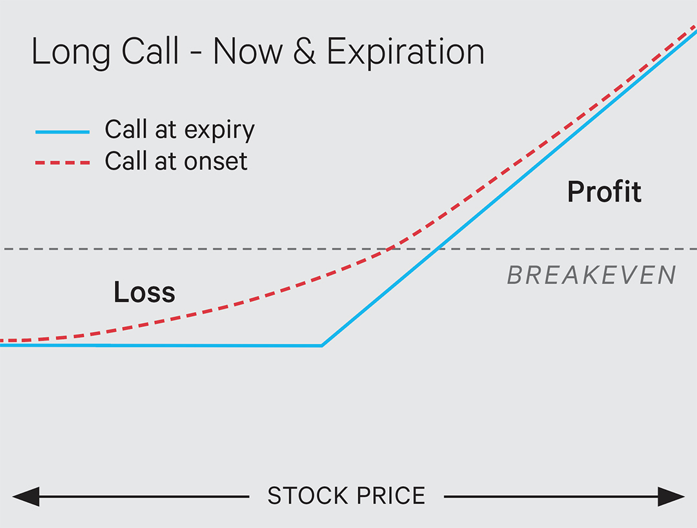
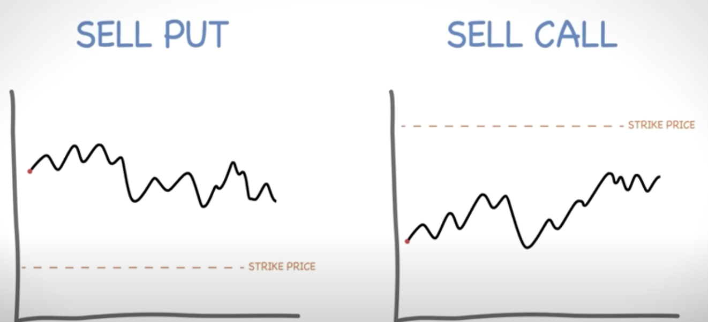
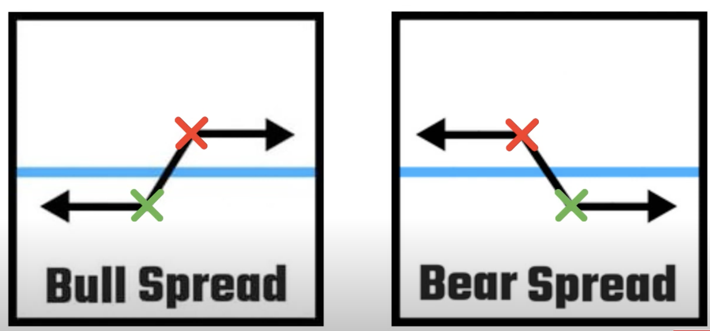
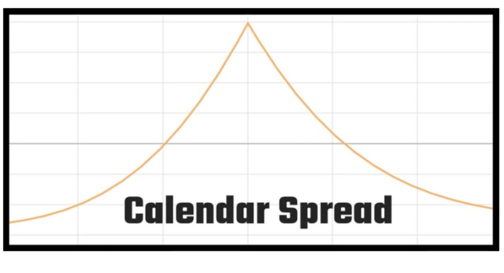
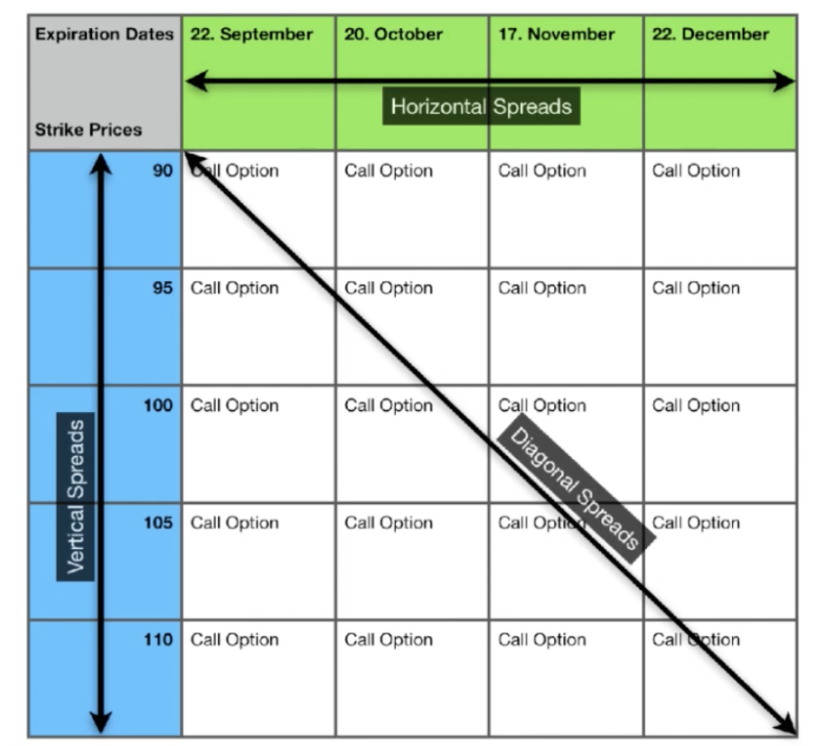

# What is an Option: 
- a contract you can purchase to buy or sell stock at an agreed price on or before a particular date. 

# Types of Options:

Calls: Gives option holder the right (but not the obligation) to BUY shares of stock, at an agreed upon price on or before a date
Puts:  Gives option holder the right (but not the obligation) to SELL shares of stock, at an agreed upon price on or before a date

- Buying Put Option: Buying Insurance
    
- Selling Put Option: Selling Insurance
  
Example: 
Bought Option Contract
Type: Call
Strike: 120

Expiration: 30 days from now 
- Owning this Call option will allow you to purchase stock at 120 per share (strike price), anytime within the next 30 days (no matter what the stock price is at)
    

## 3 Factors that Cause an Options Price to Go Up or Down:

1. Movement of the stock
    
2. Time to Expiration
    
3. Volatility of stock 
    

Option Chain: what you look at to see all available options and the price quotes of each one (You pay the ask if buying and the bid if selling)

  
  
  
  
  

# Greeks:

- Delta: Measure of how much an option’s price will change in value if the underlying stock goes up by 1 point (Calls: +, Puts: -) (ex. Delta: .47 = Option Price: + 0.47) 
- Delta also shows the probability of ending up ITM 

> As an option’s value increases it’s delta will increase 

- Gamma: amount by which DELTA will change if the stock moves up by 1 point. (Ex. Gamma: 0.05 Delta: +0.05)
    
- Theta: Amount by which an option’s price will change if 1 day passes (ex. Theta: -0.12 Option Price: -0.12 *always negative and also will be in affect with other price affects)
    
- Vega: Amount by which an option’s price will change if implied volatility increases by 1% *always positive
    
- Rho: Measures the sensitivity of the option's price to changes in interest rates 
    
# Buying and Selling Options:
Notes:
- Probability of Profit (POP): The further OTM an option is, the lower your probability will be of making money.
- **Entry Price + Strike Price = Break Even**
- You can only lose the amount you pay for an option
- Buying Power Effect: amount the options costs
- Call Options Technically have infinite max profit (lol)

- Call at Onset = the value of the call option at the time it was initially purchased or when the position was first opened.
- Choosing a further ITM strike will provide you with a better POP
- Choosing a further OTM strike will give you a better potential % return
- If you own an ITM option through expiration and DONT close it then it will automatically turn into stock 
- You can also sell a option as the opening trade aka shorting the option contract (Ideal scenarios for each below) -> Sell Put = Bullish/Neutral, Sell Call = Bearish/Neutral 

- There is a discreptancy between Theoretical Risk and Actual Risk, and Risk Pays
# Options Spreads:
- Option Spread: option stratgey involving the purchase strategy of options at different strike prices / different expiration dates on one underlying asset
## Vertical Spreads:
- Options only differ in regards to strike price 
- To do a vertical spread all you have to do is buy an option and sell an option at a different strike price
- Width of Stikes x 100 - Premium = Max Risk/Profit (Only Premium for Debit and Credit Spreads)
- Width of srikes refers to the difference in strike prices between two options of the same type (either two calls or two puts) on the same underlying asset.

## Types of Vertical Spreads:
- Call Spreads
- Put Spreads
- Bull Spreads
- Bear Spreads
- Credit Spreads
- Debit Spreads

## Horizontal Spreads: aka Calendar Spreads
  - only differ in regards to expiration date
  - Front month refers to early expiration
  - Back month refers to late expiration
  - Generally try and take advantage of movement in IV and are not very directional
  ## Types of Vertical Spreads:
- Short Call Calendar Spreads
- Long Call Calendar Spreads
- Short Put Calendar Spreads
- Long Put Calendar Spreads
### Payoff Diagram:

## Diagonal Spreads:
- Combination of vertical and horizontal spreads.
- Differ in both expiration date and strike price
 ## Types of Diagonal Spreads:
 - Iron Condor = Call Spread + Put Spread
 - Bear Call Spread + Bull Call Spread = Butterfly 

# Startegies:
1. Covered Calls:

A covered call involves holding a long position in an underlying stock and simultaneously selling a call option on the same stock. This strategy is used to generate additional income from the premiums received for selling the calls, especially in flat or mildly bullish markets. If the stock's price stays below the strike price of the call, the option will expire worthless, allowing the seller to keep the premium as profit. However, if the stock's price exceeds the strike price, the seller may have to sell the stock at the strike price, capping the upside potential.

  

2. Protective Puts:

A protective put involves buying a put option for a stock that you already own. This strategy acts as an insurance policy against a significant drop in the stock's price. The put option increases in value as the stock price falls, offsetting the loss in the stock. However, if the stock price remains stable or increases, the put option will expire worthless, and the cost of the premium will be the loss.

  

3. Bull Call Spreads:

A bull call spread is a bullish strategy that involves buying a call option while simultaneously selling another call option with a higher strike price but the same expiration date. This strategy limits the maximum loss to the cost of the spread (the difference between the premiums of the two call options) but also caps the maximum gain at the difference between the two strike prices minus the cost of the spread.

  

4. Bear Put Spreads:

A bear put spread is a bearish strategy that involves buying a put option while simultaneously selling another put option with a lower strike price but the same expiration date. This strategy aims to profit from a decline in the price of the underlying asset while limiting the investment cost and potential loss. The maximum gain is capped at the difference between the two strike prices minus the cost of the spread.

  

5. Iron Condors:

An iron condor is a neutral strategy that involves combining a bull put spread and a bear call spread. It entails selling a put and buying a lower strike put, while also selling a call and buying a higher strike call. This strategy profits from the underlying asset's price staying within the range of the two strikes. The maximum profit is the net premium received, while the maximum loss is limited to the difference between the strikes minus the net premium.

  

6. Straddles:

A straddle involves buying a call and a put option with the same strike price and expiration date. This strategy is used when a trader expects a significant price movement but is unsure of the direction. If the stock moves significantly in either direction, one of the options will increase in value more than the cost of both premiums, leading to a profit. However, if the stock price remains near the strike price, the trader may incur a loss.

  

7. Strangles:

Similar to a straddle, a strangle involves buying a call and a put option, but with different strike prices. The call strike price is higher, and the put strike price is lower than the current stock price. This strategy is also used when expecting a significant price movement but has a lower upfront cost (and potentially lower profit) compared to a straddle due to the out-of-the-money options.

## Excess Notes:

Notes:
- Options trading started in 1973
    
- You can also sell an options contract for x amount and collect a premium for it (done between traders on exchanges) 
    
- “Agreed upon price” = Strike Price = the price at which the stock will be bought or sold
    
- “Particular Date” = Expiration Date = the date at which the contract will expire
    
- Options are often used as insurance/hedge 
    
- 1 Options Contract = 100 Shares
    
- You can think of options like insurance on a stock
    
- ITM and OTM will have different colors on the option chain 
    
- The more ITM the more expensive the more OTM the cheaper 
    
- In The Money: It allows us to purchase the stock at a discount to the current market price 
    
- Out of the Money: Does not allows us to purchase the stock at a discount 
    
- Options value at expiration = difference between stock price and strike price (how far ITM it is) aka intrinsic value 
    
- The greater the expiration date the more expensive 
    
- Extrinsic Value: amount by which the options price is greater than its Intrinsic Value (left over after intrinsic value) aka Time Value 
    
- Options have time decay against you (you need options to move in your favor as well as in a certain amount of time to break even)
    
- Volatility is the magnitude of the stocks price swings 
    
- Higher volatility = more risk = more expensive option contract 
    
- Implied Volatility (IV) = Expected Volatility 
    
- Implied Volatility is determined by the options prices 
    
- You need the combination of the price, volatility, and time to be in your favor to make money on an option (or at least a net positive between them)  
    
- Positional Greeks show effects up your position rather than the contract (Negative Delta =  Short, Positive Delta = Long)
    
- Delta is a good way to measure risk 
    
- Making sure you are on the right side of time decay is key
    
