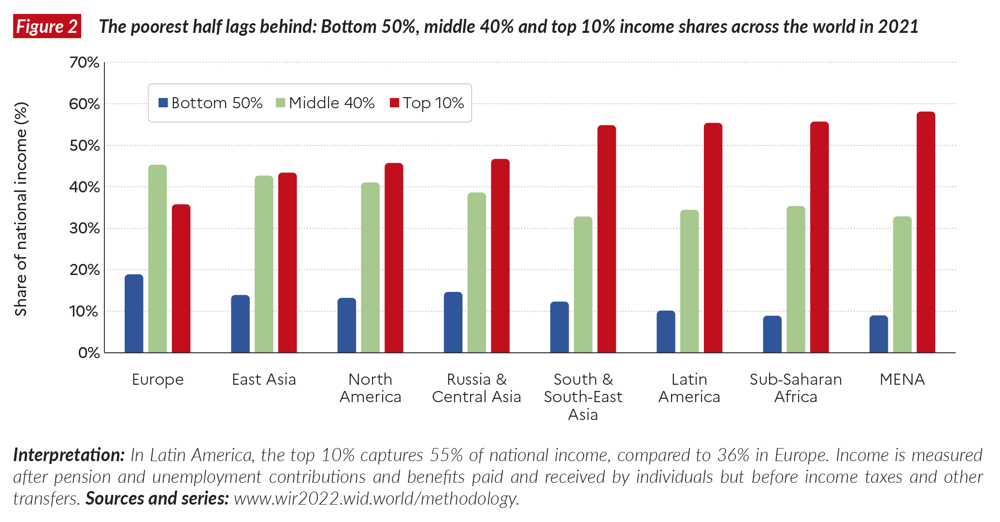
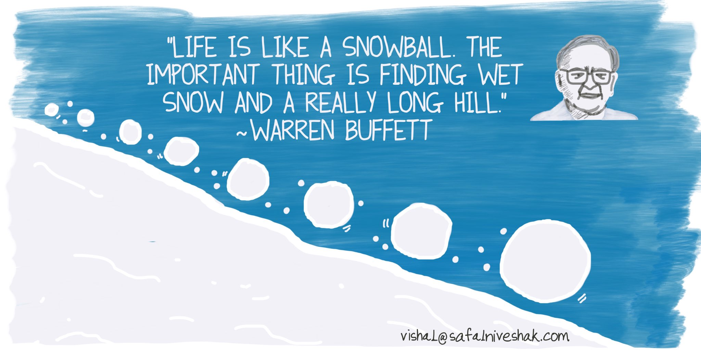
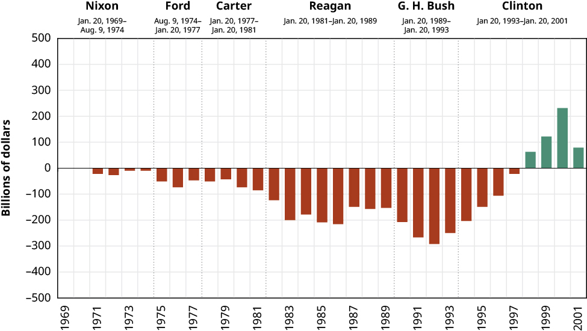

When exploring the conversation of inequality in regards to income and wealth I found myself asking questions like "Is it really a problem?", "Hasn’t there always been inequality?", "Is this just how it works?". As I dug deeper, I came to see the importance of not just whether the pie is growing, but who is getting slices. Today the richest 10% of people capture over half of all global income, while the bottom 50% share less than 10% of it.

Throughout this post we'll explore:
1. The history of inequality
2. Why it matters
3. What drives it
4. An excerpt on trickle down economics
5. Potential solutions

# History and Statistics of Inequality
In general throughout history inequality has been the norm besides a few periods and exceptions. A study from *wid.world* finds that over the last 7 centuries inequality in both wealth and income have increased with 2 major exceptions:
1. Century following The Black Plague (1400s)
2. WW1 - Mid 1970s

*Essentially, absent some of the largest shocks in human history inequality tends to grow. It is especially common to see inequality increase in periods of rapid growth ie. The Industrial Revolution.*

## The Great Compression

The latter period from WW1 - Mid 1970s is known as **The Great Compression** as inequality lowered across most of the world. This is largely due to the destruction of capital, high top rate taxes (70-90%), strong unions and welfare states driving income shares towards the middle.

An example of this is in the U.S., the top 1%’s share of pre tax income fell from ~20% in 1910 to ~10% by the 1950s. 

*Now by no means am I suggesting we rely on major world wars and economic shocks to balance inequality but it’s interesting that these kinds of events tend to be the only things historically strong enough to bend the curve downward.*

## The Modern Reversal


Since around 1980 inequality has taken off and hasn't looked back. This is far from random as this is when some of the most transformative policies in history took place with Ronald Reagan in the USA and Margaret Thatcher in the UK. Tax cuts for the wealthy, deregulation, weakened unions, and a broader embrace of market first policies all contributed to what was coined as **The Gilded Age**. Today the top 1% in the US now claim over 20% of income, levels not seen since the 1920s.

While we’re on this timeline it's hard not to mention the earlier pivot of 1971.

### WTF Happened in 1971?
In 1971, President Nixon ended the U.S. dollar’s convertibility to gold, effectively killing the Bretton Woods system and ushering in the age of fiat currency. This moment often cited in the popular website [WTF Happened in 1971](https://wtfhappenedin1971.com/) coincides with a marked divergence in trends: productivity kept rising, but wages for the average worker flatlined.

It’s not just about gold. Around this time, we also saw:
- Stagnating median incomes despite growing GDP
- Declines in union membership
- The start of hyper-financialization and corporate consolidation

Whether you believe it's causation or just correlation, it's hard to ignore how many inequality related metrics started drifting apart right around that moment.


*After bottoming out around 1970, the richest 1%’s share of income has risen steadily and now matches the highs of the Roaring Twenties.*
- Vertical axis (percent): The ratio of the top 1%’s income share to the bottom 90%’s, expressed as a negative percentage (more negative = smaller slice for the top 1%).

## Domestic vs Global Inequality 

When we are talking about inequality it is important to recognize the difference between global and domestic inequality. There are various examples of countries domestic inequality shrinking meanwhile global continues to rise.

- **Domestic (U.S.):** The Gini coefficient fell from ~0.45 to ~0.34 (1950–1975), then climbed back above ~0.41 since 1980.

- **Global:** The global Gini (all individuals, all countries) eased slightly from ~0.72 in 2000 to ~0.67 in 2020—driven by rapid growth in China and India—but remains at levels seen during the early 20th-century imperial era.

*The **Gini Coefficient** is a measure of inequality where 0 equals perfect and 1 equals max inequality.*

## Inequality Today
**Income Inequality**

Today, the richest 10% of people worldwide capture about 52% of global income, while the poorest 50% share only 8.5%. That means half the world’s population (~4 billion people) subsist on less than 1/10 of all income earned. Even in advanced economies, the top 1% now take home around 20% of national income, up from about 10% in 1979.

**Wealth Inequality**

Wealth is even more skewed: the bottom 50% of adults globally own just 2% of total household wealth, whereas the top 10% command around 76%. To put that in perspective, in 2021 the combined wealth of just ten billionaires exceeded the combined wealth of the poorest 5.1 billion people.

## Regional Differences

Inequality also varies by region:
- **Europe:** Top 10% earn ~36% of income
- **North America:** Top 10% earn ~47%
- **Latin America & MENA:** Top 10% earn ~55–58%
- **Sub-Saharan Africa:** Very high inequality in many countries, but with wide variation


# Why Inequality Matters

This section is the core of why I wrote this post. Everyone is well aware of inequality but many aren't aware of it's actual effcts. I thought that inequality may have existed but it didn't actually have all of the perceived negative impacts people thought it might.

I posed the question *"If everyone is wealthy but some people at the top are just substantially more wealthy, is that really a problem?"* thinking maybe this is just an economic growth problem but that doesn't seem to be the case.

The first important metric to note is the difference between **Absolute and Relative Wealth:**

- Absolute Wealth is about how well off people are in real terms (food, healthcare, education). If everyone earns $200K/year, most will feel comfortable.
- Relative Wealth is about how people perceive their standing. Even in a rich society, a large gap between the 99th and 50th percentiles can breed problems.

## Issues Regarding Relative Wealth:

**Demand and Growth Dynamics:**

When most people are well paid, they spend more. Strong middle class demand fuels stable economic growth. By contrast, if wealth piles up at the top, the wealthy are more likely to save or invest in financial assets, which doesn’t circulate back as robustly.

*The IMF found that a 1 pp increase in the bottom 20%’s income share boosts GDP growth by ~0.38 pp, whereas a similar gain at the top 20% hurts growth.*

**Social Health:**

Unequal societies score lower on measures of social trust and community engagement. Studies (e.g. The Spirit Level) show more unequal countries suffer from:
- Lower social trust and community engagement
- Higher rates of obesity, mental illness, and violent crime
- Shorter life expectancy—even for the well-off

**Motivation and Oppurtunity:**

High inequality often correlates with low intergenerational mobility. The “Great Gatsby Curve” illustrates this: countries with higher income gaps (high Gini) tend to have lower intergenerational mobility. In practical terms:
- Children born into wealth get the best schools, tutoring, internships, and networks.
- Children from modest backgrounds find doors closing early and may not even try.

## Everyone's Loss
- Economic waste: Under leveraged demand and under utilized talent drag on growth.
- Social fracture: Low trust and high stress undermine public health and safety.

So yes, absolute wealth matters. But once basic needs are met, it’s relative wealth that shapes our well being, our economy, and the vibrancy of our society. When large swaths of talent go un-nurtured, society loses potential Einsteins or Lovelaces and the next wave of entrepreneurial minds never gets the shot to change the world. 

# Anatomy of Inequality: Key Drivers
Before we can look into solutions for inequality we need to understand what is causing it in the first place. In this section we will go over what I found to be the most important drivers of inequality.

## Capital vs. Growth
The fundamental cause of wealth/income inequality is that **wealth tends to reproduce itself** at scale. Economist Thomas Picketty famously summarized this with the following formula **r (rate of return on capital)  >  g (overall economic growth rate)**, meaning the rate of return on capital exeeds an economy's growth rate.
```
Annual Investment ROI avg: 4-5% (modern investments tend to be actually 8-10%+)
Annual Economic ROI (GDP Growth): 1-2% 
```

**Snowball Effect:**

*As Alice Schroeder describes in "The Snowball: Warren Buffett and the Business of Life", Buffett’s wealth grew like a snowball rolling downhill slow at first, then gathering size (and speed) as compounding stacked gains upon gains. The same dynamic applies at scale: those with capital see their fortunes snowball, while wage earners can’t keep up with the pace of compound returns.*

## Policy, Technology & Globalization
Three interconnected forces of government policy, technological change, and global market integration have together increased inequality further:

**1. Policy Choices Tilt the Scales**

- Since the 1980s, top tax rates and welfare spending have been cut back in many countries, letting the wealthy keep a bigger slice of gains.
- OECD data show that redistribution’s power to compress incomes has weakened: most advanced economies now do less, not more, to offset market driven gaps.

**2. Tech Rewards**

- Automation and digital tools replace routine work, pushing up earnings for those with in demand skills (think engineers and data scientists) while stagnating pay for the rest.

**3. Global Markets Shift Jobs and Bargaining Power**

- Companies chasing lower labor costs offshore manufacturing and service roles, putting downward pressure on wages in rich countries.
- Capital flows freely overseas, so investment often chases returns in financial markets or low cost regions instead of fueling local job growth.

# An Excerpt on Trickle Down Economics

"Trickle Down Economics" is a popular term closely associated with supply side economics advocated for in the 1980s by Reagan and Thatcher. It's important to note that "Trickle Down Economics" isn't any form of real economic theory or something government used to describe their strategy but rather a name coined by people who advocated against it. The claim of so called "Trickle Down Economics" is that policies that are made to benefit the wealthy will "trickle down" to benefit everyone.


Summarized in the famous saying *"A rising tide lifts all boats."*

This was the overarching idea of what Ronald Reagan called "Reaganomics", stating that *"if wealthy people and corporations keep more of their earnings, they will invest, expand, create jobs, etc.,benefitting all."*

## Results of Trickle Down Economics

When supply side tax cuts first rolled out under Reagan in the 1980s, the economy did experience a sharp rebound from recession. GDP growth accelerated, unemployment fell, and inflation came under control. Yet much of that turnaround is now credited to the Federal Reserve’s aggressive interest rate cuts rather than the tax cuts themselves. Similar experiments under George W. Bush (2001–03) and Donald Trump (2017) produced more modest growth spurts, with real gains emerging only when the Fed again eased monetary policy to prop up demand. In each case, headline numbers looked good for a time but the engine powering the expansion was loose money, not trickle down incentives.

At the same time, every major round of top end tax cuts shrank government revenues and sent deficits soaring. Rather than unleashing a wave of new factories and jobs, wealthy individuals and corporations tended to park their tax savings in financial markets buying back shares or stacking cash while middle class wages remained largely unchanged. In other words, cutting taxes at the top did not “pay for itself” through business investment or hiring, it simply redistributed income upward.



That said, some argue trickle down policies may produce qualitative or longer term benefits that are harder to capture in short-term data. These could include fostering a more competitive business climate, encouraging risk-taking, or attracting foreign investment. It's also possible that lower taxes improve incentives in subtle ways motivating founders, easing succession planning, or boosting confidence. While these effects are difficult to quantify, they’re worth acknowledging. Still, even if they exist, the overall evidence suggests they don’t outweigh the more direct and measurable downsides: higher deficits, rising inequality, and stagnant wages for the majority.

# Potential Solutions to Inequality 

Before we talk about potential solutions for inequality, it's important to note that **not all inequality is inherently bad.** Some level of income and wealth differentiation is essetnial in any healthy economy to reward innovation, risk taking, hard work, and skill. A perfectly equal society where outcomes are identical regardless of contribution wouldn’t be functional or fair either.

From what I can tell the goal isn’t to eliminate inequality completely, but to ensure that everyone has a fair shot. The most important thing we can do is aim for equality of opportunity, so that anyone regardless of their starting point, has the chance to grow with the economy.

**Approaches:**
1. Education and Training

In my opinion perhaps the most important point is ensuring access to high quality education from early childhood to post secondary and vocational programs helps close the skills gap and unlock upward mobility. The more people in a economy that can reach their full potential the better **for everyone** in an economy.

2. Progressive Taxation

A more progressive tax system ensures that those with the greatest ability to contribute do so. This doesn’t mean punishing success, but rather recognizing diminishing marginal utility an extra dollar means less to someone making $10 million than to someone making $30,000.

3. Social Spending

Targeted social programs (e.g. healthcare, childcare, housing, income supports) can cushion life’s shocks and create a stronger baseline for all citizens. *Crucially, these aren’t just “handouts”, they're public investments in human potential.*

**Obviously none of these ideas are revolutionary and that hasn't been my goal in writing this. Sadly despite my research I haven't been able to reinvent the wheel, but instead highlight what seems to work. These are levers that, based on everything I’ve read, seem to give people a fairer shot while still encouraging innovation and growth.*

# Reflection and Conclusion

When I started writing this my goal was largely to understand the impacts of inequality on a society. I assumed that like many problems, inequality was just something that could be solved by more growth. While this may parly be true, there is a lot more that can be done. 

If there's one key takeaway from this exploration, it's that wealth and income inequality negatively affect everyone, not just those at the bottom. Improving inequality means, innovation grows, health improves, economies stabilize, and trust rises. And the best part? Reducing inequality doesn’t mean someone else has to lose, it means more people can win.

That said, it’s important to keep perspective. Despite rising inequality, humans have made massive progress by almost every measure: poverty, quality of life, education, health, life expectancy, the list goes on. The arc of history has been bending toward better and we will continue to bend that arc.

And not all equality is inherently good either. Mao’s China had almost no inequality but nearly everyone was poor. Meanwhile, countries like the U.S. or India have seen tremendous innovation and growth despite high inequality. Clearly, the goal isn’t simply to reduce inequality for its own sake, but to maximize growth and ensure as many people as possible benefit from it, something modern China has done better than most.

Over taxing the rich won’t work if it causes capital flight or discourages innovation. The truth is, wealthy individuals and corporations play a vital role in society if incentives are aligned in a way that benefits both them and the broader population.

Maybe the uncomfortable truth is that inequality is a feature, not a bug. This is just how it works and we aren't able to find this perfect balance we strive for. But giving in to that cynicism doesn’t help anyone. We’re better off striving for systems that reward effort without trapping people at the bottom, even if it may seem impossible.

*This post is by no means meant to be political or the endorsing of any ideaology, party, etc. Rather the goal of writing this was selfish in my hopes to understand and learn about the impacts of inequality and to share my findings whatever they may be.*