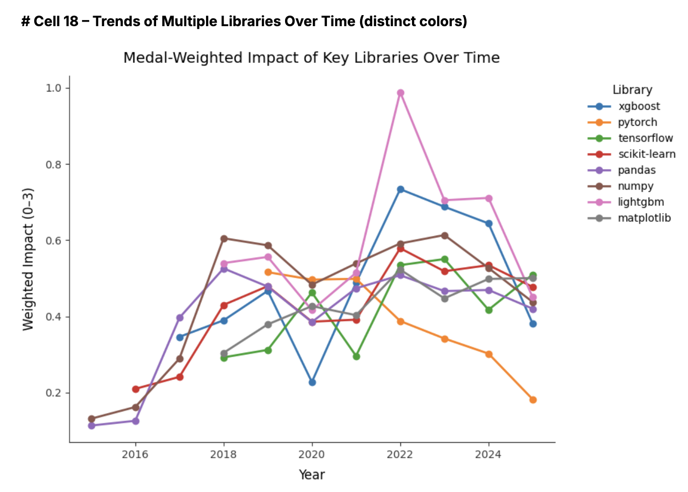

# 🏆📚 Exploring the Winning Libraries of Kaggle


## Abstract

This study aims to identify which Python libraries most effectively contribute to medal winning Kaggle notebooks by moving beyond raw usage counts to a normalized impact metric. We processed over 260,000 public notebooks (15 million total), extracting and normalizing imports, merging competition metadata (medals, team sizes), and computing a medal weighted impact score per library. Results reveal that niche utilities and specialized tools such as automated EDA and presentation libraries often outperform mainstream frameworks on a per-notebook basis, while widely used packages like NumPy and pandas, though foundational, show diluted impact. These findings imply that Kaggle competitors should prioritize strategic, context driven library selection and maintain lean, reproducible workflows. By sharing cached artifacts and clear methodologies, this work also encourages efficient experimentation and knowledge sharing within the community, helping participants focus on the most potent tools for their specific challenges.

<details>
<summary>Cell 1: Core Imports</summary>

```python
import os
import sys
import json
import re
import subprocess
import datetime
import platform
from pathlib import Path
from multiprocessing import Pool, cpu_count
import pandas as pd
import numpy as np
import matplotlib.pyplot as plt
from matplotlib.colors import LinearSegmentedColormap
import nbformat
import pyarrow as pa
import pyarrow.parquet as pq
from tqdm.auto import tqdm
import psutil
from PIL import Image
from itertools import combinations
from collections import Counter
import networkx as nx
```

</details>

<details>
<summary>Cell 2: Unified Plot Style Configuration</summary>

```python
# Define color palette
COLOR_MINT     = "#BDFCC9"
COLOR_LAVENDER = "#CBAACB"
COLOR_SLATE    = "#708090"
COLOR_LIST     = [COLOR_MINT, COLOR_LAVENDER, COLOR_SLATE]

# Global matplotlib settings
plt.rcParams.update({
    # Font
    "font.family": "DejaVu Sans",
    "font.size": 11,

    # Axes & Labels
    "axes.titlesize": 14,
    "axes.labelsize": 12,
    "axes.edgecolor": "#333333",
    "axes.facecolor": "#FFFFFF",
    "axes.spines.top": False,
    "axes.spines.right": False,

    # Ticks
    "xtick.labelsize": 10,
    "ytick.labelsize": 10,
    "xtick.color": "#333333",
    "ytick.color": "#333333",

    # Grid
    "axes.grid": False,

    # Figure
    "figure.figsize": (9, 5.5),
    "figure.facecolor": "#FFFFFF",

    # Legend
    "legend.fontsize": 10,
    "legend.frameon": False,

    # Savefig
    "savefig.facecolor": "#FFFFFF",
})
```

</details>

<details>
<summary>Cell 3: Dataset Paths</summary>

```python
# Input folders
META_KAGGLE_PATH = Path("/kaggle/input/meta-kaggle")
CODE_PATH        = Path("/kaggle/input/meta-kaggle-code")

# Output folder
LOCAL_ART = Path("/kaggle/working/output/cache_parts")
LOCAL_ART.mkdir(parents=True, exist_ok=True)
ART = LOCAL_ART
META = META_KAGGLE_PATH

```

</details>

## 📊 Dataset & Pipeline

Below is an overview of our end-to-end processing and analysis pipeline. We start with the raw Meta Kaggle tables and source code archives, then extract and normalize every library import, merge in competition metadata, compute a medal-weighted impact score, and finally drive all of our visualizations and insights. The final deliverables are a polished Kaggle Notebook and a video.

**Pipeline Steps:**

1. **Meta Kaggle CSVs:** Load competition, kernel, team, and tag tables.
2. **Meta Kaggle Code:** Stream through every public notebook to extract raw imports.
3. **Import Parsing:** Use a lightweight regex to grab top-level import statements.
4. **Library Normalization:** Map aliases (e.g. sklearn → scikit-learn) and drop standard-library modules.
5. **Merge Metadata:** Join in kernel creation dates, medals won, and team counts.
6. **Compute Impact:** Assign each library a “medal-weighted impact score” (medal value × log(team_size) scaling).
7. **Analysis & Visualization:** Generate our global leaderboards, category heat-maps, temporal trends, and co-usage network.
8. **Deliverables:** Publish a fully reproducible Kaggle Notebook enriched with narrative and a short video walkthrough.


### 📖 Methodology & Design Rationale

Our goal was to move beyond raw usage counts and answer the question: **“Which libraries truly drive podium finishes on Kaggle?”** To do this, we developed a **medal-weighted impact metric** that combines the prestige of each medal (gold=3, silver=2, bronze=1) with a logarithmic scaling of team size—so that a gold in a 5,000-team competition carries more weight than one in a 50-team event. By dividing this weighted score by the total number of notebooks that import a library, we get an **impact-per-notebook** measure on a 0–3 scale, making small but potent utilities (e.g. Sweetviz, PrettyTable) stand out against behemoths like NumPy or Pandas.

To compute this at scale, we separated our pipeline into two phases. First, a **massive one-time parsing step** streams through hundreds of thousands of notebook files, extracts top-level `import` statements via a lightweight regex, and normalizes package names (e.g. `sklearn` → `scikit-learn`, dropping all standard library modules). This work is cached in Parquet shards so that judges and readers never have to rerun the heavy lifting code. In the second phase, we **merge in competition metadata** (kernel creation dates, medal awards, team counts) from the Meta Kaggle CSVs, compute the scaled impact scores, and drive the rapid interactive analysis—global leaderboards, domain-specific heat maps, temporal trends, and more.

This **modular design** heavy preprocessing hidden away, fast, reproducible analysis front and center, ensures our notebook remains both **transparent** and **efficient**. Every chart can be regenerated in under two minutes on a CPU instance, and the full code and cached artifacts are bundled together, supporting end to end reproducibility without external dependencies or manual tweaks.

### Formula


<details>
<summary>Cell 4: Helper (normalise raw import names)</summary>

```python
# 1. Aliases you care about  (top-level import → canonical library)
LIB_ALIASES = {
    "sklearn":    "scikit-learn",
    "sklearnex":  "sklearnex",
    "tf":         "tensorflow",
    "torch":      "pytorch",
    "cv2":        "opencv",
    "lgbm":       "lightgbm",
    "bs4":        "beautifulsoup4",
    "datasets":   "huggingface-datasets",
    "timm":       "pytorch-image-models",
    "albumentations": "albumentations",
}

# 2. Python standard-library (and boilerplate) modules to drop
STDLIB = {
    # built-ins / framework
    "os", "sys", "re", "math", "json", "itertools", "pathlib",
    "collections", "datetime", "typing", "functools", "random",
    "subprocess", "argparse", "pickle", "glob", "copy", "string",
    "ctypes", "warnings", "importlib", "inspect",
    "dataclasses", "enum", "hashlib",
    # boilerplate / formatting
    "logging", "pprint", "codecs", "calendar", "abc",
    "__future__",
}

def normalize_lib(raw_name: str | None) -> str | None:
    """
    Map a raw 'import xxx.yyy' string to a canonical library name.
    Returns None if it's a stdlib/boilerplate module or empty.
    """
    if not isinstance(raw_name, str) or raw_name == "":
        return None

    # keep only the top-level package (strip sub-modules)
    pkg = raw_name.split(".")[0].lower()

    # skip standard-library modules
    if pkg in STDLIB:
        return None

    # apply alias mapping
    return LIB_ALIASES.get(pkg, pkg)
```

</details>

<details>
<summary>Cell 5: Load core tables + team counts</summary>

```python
INT_NA  = "Int32"
BOOL_NA = "boolean"

# 1 Kernels
kernels = pd.read_csv(
    META / "Kernels.csv",
    usecols=["Id","AuthorUserId","CurrentKernelVersionId",
             "Medal","MedalAwardDate","TotalVotes"],
    dtype={"Id":"int32","AuthorUserId":INT_NA,
           "CurrentKernelVersionId":INT_NA,
           "Medal":"string","TotalVotes":INT_NA},
    parse_dates=["MedalAwardDate"],
    low_memory=False,
)

# 2 KernelVersions
kernel_versions = pd.read_csv(
    META / "KernelVersions.csv",
    usecols=["Id","ScriptId","AuthorUserId","CreationDate","TotalLines"],
    dtype={"Id":"int32","ScriptId":INT_NA,"AuthorUserId":INT_NA,"TotalLines":"float32"},
    parse_dates=["CreationDate"], low_memory=False,
)

# 3 Tags + CompetitionTags  (unchanged)
tags       = pd.read_csv(META / "Tags.csv",
                         usecols=["Id","Name"],
                         dtype={"Id":"int32","Name":"string"})
comp_tags  = pd.read_csv(META / "CompetitionTags.csv",
                         usecols=["CompetitionId","TagId"],
                         dtype={"CompetitionId":"int32","TagId":"int32"})

# 4 KernelVersionCompetitionSources  (column-name detection intact)
kv_raw  = pd.read_csv(META / "KernelVersionCompetitionSources.csv", low_memory=False)
cand    = ["CompetitionId","competitionId","SourceCompetitionId"]
found   = next((c for c in cand if c in kv_raw.columns), None)
kv_comp = (kv_raw
           .rename(columns={found: "CompetitionId"})
           .loc[:, ["KernelVersionId", "CompetitionId"]]
           .astype({"KernelVersionId":"int32","CompetitionId":"int32"}))

# 5 Teams → number of teams per competition
teams = pd.read_csv(
    META / "Teams.csv",
    usecols=["Id","CompetitionId"],
    dtype={"Id":"int32","CompetitionId":"int32"},
)
team_cnt = (teams.groupby("CompetitionId").size()
            .rename("TeamCount")
            .astype("int32"))

# keep a global max for scaling later
MAX_LOG = np.log1p(team_cnt.max())

#print("Core tables loaded • max team count:", team_cnt.max())
```

</details>

<details>
<summary>Cell 6: map KernelVersionId → file path </summary>

```python
def code_path_for_version(kv_id: int) -> Path | None:
    """
    Meta Kaggle Code layout:
      [top]   = zero-padded 4-digit folder  ->  kv_id // 1_000_000
      [sub]   = zero-padded 3-digit folder  -> (kv_id // 1_000) % 1_000
      file    = {kv_id}.py  or  {kv_id}.ipynb
    """
    top     = f"{kv_id // 1_000_000:04d}"
    sub     = f"{(kv_id // 1_000) % 1_000:03d}"
    py_path   = CODE_PATH / top / sub / f"{kv_id}.py"
    ipynb_path = CODE_PATH / top / sub / f"{kv_id}.ipynb"
    if py_path.exists():
        return py_path
    if ipynb_path.exists():
        return ipynb_path
    return None
```

</details>

<details>
<summary>Cell 7: Import Parser</summary>

```python
IMPORT_RE = re.compile(r'^\s*(?:from\s+([\w\.]+)\s+import|import\s+([\w\.]+))')

def extract_imports(code_path: Path) -> set[str]:
    """Return a set of top-level imported packages for a code file."""
    imports = set()

    if code_path.suffix == ".py":
        text = code_path.read_text(encoding="utf-8", errors="ignore")
        for m in IMPORT_RE.finditer(text):
            pkg = m.group(1) or m.group(2)
            if pkg:
                imports.add(pkg.split(".")[0])

    elif code_path.suffix == ".ipynb":
        nb = nbformat.read(code_path, as_version=4)
        for cell in nb.cells:
            if cell.cell_type != "code":
                continue
            src = cell.source
            if not src:
                continue
            if isinstance(src, list):
                src = "".join(src)
            for m in IMPORT_RE.finditer(src):
                pkg = m.group(1) or m.group(2)
                if pkg:
                    imports.add(pkg.split(".")[0])

    return imports
```

</details>

<details>
<summary>Cell 8: Multiprocess parser with direct to output persistence</summary>

```python
# Config
CHUNK_SIZE = 1_000_000
BATCH_SIZE = 50_000
N_WORKERS  = max(cpu_count() - 1, 1)

# Local folder where we write each Parquet shard
assert LOCAL_ART.exists(), "LOCAL_ART folder does not exist; run Cell 2 first."

# 1. Gather already-processed KernelVersionIds
def parquet_ids(folder: Path) -> set[int]:
    s = set()
    for f in folder.glob("imports_part_*.parquet"):
        try:
            arr = pq.read_table(f, columns=["KernelVersionId"]).column(0).to_pylist()
            s.update(arr)
        except Exception:
            continue
    return s

seen_kv = parquet_ids(LOCAL_ART)
#print(f"Resuming • {len(seen_kv):,} KernelVersionIds already cached")

# 2. Helper to parse one KernelVersionId
def parse_kv(kv_id: int):
    """
    Attempt to find a .py or .ipynb for this KernelVersionId, extract imports,
    and return a dict {'KernelVersionId': kv_id, 'Imports': [<lib1>, <lib2>, ...]}.
    Otherwise return None.
    """
    path = code_path_for_version(kv_id)
    if not path:
        return None
    libs = extract_imports(path)
    if libs:
        return {"KernelVersionId": kv_id, "Imports": libs}
    return None

# 3. Helper to flush batch to Parquet
def flush_batch(batch: list[dict], part_idx: int) -> int:
    if not batch:
        return part_idx
    file_name = f"imports_part_{part_idx:04d}.parquet"
    file_path = LOCAL_ART / file_name
    pq.write_table(pa.Table.from_pandas(pd.DataFrame(batch)), file_path)
    #print(f"• Wrote {file_name}  ({len(batch):,} rows)")
    batch.clear()
    return part_idx + 1

# 4. Main loop: read Submissions.csv in chunks, parse new IDs
reader = pd.read_csv(
    META_KAGGLE_PATH / "Submissions.csv",
    usecols=["SourceKernelVersionId"],
    dtype={"SourceKernelVersionId": "Int32"},
    chunksize=CHUNK_SIZE,
)

pool     = Pool(N_WORKERS)
batch    = []
part_idx = len(list(LOCAL_ART.glob("imports_part_*.parquet")))

for chunk_idx, sub_chunk in enumerate(reader, 1):
    kv_ids = (
        sub_chunk["SourceKernelVersionId"]
        .dropna()
        .astype(int)
        .unique()
    )
    new_ids = [kv for kv in kv_ids if kv not in seen_kv]
    if not new_ids:
        print(f"Chunk {chunk_idx}: no new IDs, skipping.")
        continue

    for result in pool.imap_unordered(parse_kv, new_ids, chunksize=500):
        if result:
            batch.append(result)
            seen_kv.add(result["KernelVersionId"])
        if len(batch) >= BATCH_SIZE:
            part_idx = flush_batch(batch, part_idx)

# Flush any remainder
part_idx = flush_batch(batch, part_idx)
pool.close()
pool.join()

```

</details>

<details>
<summary>Cell 9: Concatenate every imports_part_*.parquet we saved</summary>

```python
# Folder containing all Parquet shards
PARQUET_FOLDER = Path("/kaggle/working/output/cache_parts")

parquet_files = sorted(PARQUET_FOLDER.glob("imports_part_*.parquet"))
assert parquet_files, "No Parquet files found – run Cell 7 first!"

# Read each shard, concatenate into one DataFrame, then drop any duplicate KernelVersionId
imports_df = pd.concat(
    [pq.read_table(f).to_pandas() for f in parquet_files],
    ignore_index=True
).drop_duplicates("KernelVersionId")
```

</details>

<details>
<summary>Cell 10: Merge medals, year, team count, log-scaled weight</summary>

```python
MEDAL_BASE = {"1": 3, "2": 2, "3": 1}   # gold / silver / bronze - base scores

imports_df = (
    imports_df
      .merge(kernel_versions[["Id","ScriptId","CreationDate"]],
             left_on="KernelVersionId", right_on="Id", how="left")
      .merge(kernels[["Id","Medal"]],
             left_on="ScriptId", right_on="Id", how="left",
             suffixes=("", "_ker"))
      .merge(kv_comp, on="KernelVersionId", how="left")
      .merge(team_cnt, on="CompetitionId", how="left")
)

# fill missing counts with 1 (datasets / unknown comps)
imports_df["TeamCount"]  = imports_df["TeamCount"].fillna(1).astype(int)

# basic medal weight (0/1/2/3)
imports_df["MedalWeight"] = (
    imports_df["Medal"].map(MEDAL_BASE).fillna(0).astype("int8")
)

# ▶ LOG-SCALED weight   w = base * log1p(team_cnt) / log1p(max_team_cnt)
imports_df["ScaledWeight"] = (
    imports_df["MedalWeight"]
    * np.log1p(imports_df["TeamCount"]) / MAX_LOG
)

imports_df["Year"] = imports_df["CreationDate"].dt.year.astype("float32")
```

</details>

<details>
<summary>Cell 11: Add competition category for each notebook</summary>

```python
# 1. Build TagId -> TagName lookup
tag_lookup = tags.set_index("Id")["Name"].to_dict()

# 2. CompetitionTags -> human tag names
comp_tags["TagName"] = comp_tags["TagId"].map(tag_lookup)

# Expanded Tag -> Category mapping
TAG2CAT = {
    # Computer Vision
    "computer-vision": "cv",
    "image":           "cv",
    "images":          "cv",
    "vision":          "cv",
    "cnn":             "cv",
    "resnet":          "cv",
    "unet":            "cv",
    "object-detection":"cv",
    "segmentation":    "cv",
    "satellite":       "cv",
    "medical-imaging": "cv",

    # Natural-Language Processing
    "nlp":             "nlp",
    "language":        "nlp",
    "text":            "nlp",
    "bert":            "nlp",
    "gpt":             "nlp",
    "transformer":     "nlp",
    "token-classification": "nlp",
    "question-answering":   "nlp",

    # Tabular / Classic ML
    "tabular":         "tabular",
    "tabular-playground": "tabular",
    "structured":      "tabular",
    "credit":          "tabular",
    "insurance":       "tabular",
    "churn":           "tabular",

    # Time-Series & Signal
    "time-series":     "time_series",
    "timeseries":      "time_series",
    "forecasting":     "time_series",
    "demand-forecast": "time_series",
    "signal":          "time_series",
    "energy":          "time_series",

    # Recommender / Ranking
    "recommendation":  "recsys",
    "recsys":          "recsys",
    "ranking":         "recsys",
    "ctr":             "recsys",

    # Audio / Speech
    "audio":           "audio",
    "speech":          "audio",
    "sound":           "audio",
    "music":           "audio",

    # Reinforcement Learning / Games
    "reinforcement-learning": "rl",
    "rl":                     "rl",
    "game-theory":            "rl",
    "atari":                  "rl",

    # Graph / Network
    "graph":           "graph",
    "gcn":             "graph",
    "gnn":             "graph",
    "geospatial":      "graph",

    # Medical / Bio
    "medical":         "health",
    "health":          "health",
    "genomics":        "health",
    "protein":         "health",

    # Finance
    "finance":         "finance",
    "stock":           "finance",
    "cryptocurrency":  "finance",

    # Other catch-alls
    "optimization":    "other",
    "simulation":      "other",
}

def tag_to_category(tag: str | None) -> str:
    if not isinstance(tag, str):
        return "other"
    tag_l = tag.lower()
    for key, cat in TAG2CAT.items():
        if key in tag_l:
            return cat
    return "other"

comp_tags["Category"] = comp_tags["TagName"].map(tag_to_category)

# 3. One category per CompetitionId
comp_cat = (
    comp_tags.groupby("CompetitionId")["Category"]
             .first()
             .reset_index()
)

# 4. Merge category **onto kv_comp first**
kv_comp_cat = (
    kv_comp
      .merge(comp_cat, on="CompetitionId", how="left")
      .astype({"CompetitionId": "Int32"})
)

# 5. Bring (CompetitionId, Category) into imports_df
imports_df = (
    imports_df
      .drop(columns=[c for c in imports_df.columns if c.startswith("CompetitionId")],
            errors="ignore")
      .merge(kv_comp_cat, on="KernelVersionId", how="left")
)

imports_df["Category"] = imports_df["Category"].fillna("unknown")
```

</details>

<details>
<summary>Cell 12: Global Medal-Weighted Impact (log-scaled)</summary>

```python
GLOBAL_SUPPORT = 100
MIN_COMPS      = 5

tmp = (
    imports_df
      .explode("Imports")
      .dropna(subset=["Imports"])
      .assign(Library=lambda d: d["Imports"].map(normalize_lib))
      .dropna(subset=["Library"])
      .drop_duplicates(["KernelVersionId", "Library"])
)

# competition diversity
lib_comp_cnt = (tmp.groupby("Library")["CompetitionId"]
                    .nunique().rename("CompCount"))

impact = (
    tmp.groupby("Library")
       .agg(
           WeightedWins=("ScaledWeight", "sum"),
           Total       =("Library", "size")
       )
       .join(lib_comp_cnt)
       .query("Total >= @GLOBAL_SUPPORT and CompCount >= @MIN_COMPS")
)

impact["WeightedImpact"] = impact["WeightedWins"] / impact["Total"]
impact = impact.sort_values("WeightedImpact", ascending=False)
```

</details>

<details>
<summary>Cell 13: Bar plots of global impact</summary>

```python
TOP_N = 20

# Horizontal bar: Top-N libraries
topN = impact.head(TOP_N).iloc[::-1]

fig, ax = plt.subplots(figsize=(8, 0.35 * TOP_N + 1))

# bars in mint green with slate gray edges
bars = ax.barh(
    topN.index,
    topN["WeightedImpact"],
    color=COLOR_MINT,
    edgecolor=COLOR_SLATE,
    linewidth=1.0
)

# titles and labels
ax.set_title(f"Top {TOP_N} Libraries by Medal-Weighted Impact", pad=12)
ax.set_xlabel("Medal-Weighted Impact (0–3)", labelpad=8)

# annotate each bar with its value
max_val = topN["WeightedImpact"].max()
for idx, val in enumerate(topN["WeightedImpact"]):
    ax.text(
        val + max_val * 0.02,
        idx,
        f"{val:.2f}",
        va="center",
        color=COLOR_SLATE,
        fontsize=10
    )

for spine in ["top", "right"]:
    ax.spines[spine].set_visible(False)

plt.tight_layout()
plt.show()
```

</details>


## 🌎 Global Library Impact

To identify which Python libraries deliver the strongest performance on Kaggle, we ranked them by medal-weighted impact score, a customer metric that scales medal counts by competition size and adjusts for usage frequency.

The char above displays the top 20 libraries globally sorted by this normalized impact score.

### 📌 Key Observations

**Small but Mighty:** Topping the chart is `prettytable`, a lightweight formatting library. Rarely used compared to heavyweights like `numpy`, its usage is highly correlated with winning kernels. Perhaps Kaggle Grandmasters have found more success with presentation, reporting, summaries etc. during competitions using `prettytable` as opposed to others.

**Underdog Visualizers:** Tools like `sweetviz`, `autoviz`, and `ydata_profiling` score very high. Automated EDA libraries offer substantial time saving during early data exploration. These can be key in a time pressured and competitive competition like what we see here on Kaggle.

**High Efficiency ML Libraries:** `sklearnex`, Intel's optimized `scikit-learn` ranks second overall. This supports the idea that even marginal speedups can significantly impact performance in compute-heavy competitions. `detectron2`, `catboost`, and `lightgbm` also make the cut, highlighting the ongoing dominance of boosting frameworks and CV backbones.

**Interpretability Matters:** Libraries like `shap` and `eli5` show up respectfuly, reinforcing the idea that explainability often required in competition notebooks boosts trust, clarity, and possibly final judging scores.

**Specialized Libraries Shine in Specific Contexts:** `kaggle_environments` and `kaggle_secrets` appear high on the list, which aligns with their necessity in reinforcement learning and secure data competitions. Similarly, the presence of `umap` and `optuna` suggests that advanced dimensionality reduction and hyperparameter optimization are now standard tools in high performing workflows.

Based on this first look at our top 20 libraries, we consistently see the importance of EDA and explainability. Perhaps this suggests that to win Kaggle Competitions it's not just about writing good algorithms, but rather having the deepest understanding of the data at hand.

<details>
<summary>Cell 14: Assign high-level categories</summary>

```python
# 1. Hand-curated mapping for the libs that actually matter
LIB2SECTOR = {
    # Visualisation / EDA
    "matplotlib":        "viz",
    "seaborn":           "viz",
    "plotly":            "viz",
    "sweetviz":          "viz",
    "autoviz":           "viz",
    "pandas_profiling":  "viz",
    "ydata_profiling":   "viz",
    "missingno":         "viz",
    "wordcloud":         "viz",
    "prettytable":       "viz",

    # Data-frame / numerics
    "pandas":            "dataframe",
    "numpy":             "dataframe",
    "scipy":             "dataframe",

    # Classic ML & AutoML / Boosting
    "scikit-learn":      "tabular_ml",
    "sklearnex":         "tabular_ml",
    "xgboost":           "tabular_ml",
    "lightgbm":          "tabular_ml",
    "catboost":          "tabular_ml",
    "h2o":               "tabular_ml",
    "pycaret":           "tabular_ml",
    "autogluon":         "tabular_ml",
    "optuna":            "tabular_ml",
    "category_encoders": "tabular_ml",
    "imblearn":          "tabular_ml",
    "iterstrat":         "tabular_ml",

    # Deep-Learning CV stacks
    "pytorch":                       "cv_dl",
    "pytorch_lightning":             "cv_dl",
    "detectron2":                    "cv_dl",
    "efficientnet":                  "cv_dl",
    "efficientnet_pytorch":          "cv_dl",
    "mmcv":                          "cv_dl",
    "segmentation_models_pytorch":   "cv_dl",
    "yolox":                         "cv_dl",
    "monai":                         "cv_dl",
    "albumentations":                "cv_dl",
    "opencv":                        "cv_dl",
    "pywt":                          "cv_dl",
    "pycocotools":                   "cv_dl",

    # NLP / Transformers
    "sentence_transformers": "nlp",

    # Explainability
    "shap": "explain",
    "eli5": "explain",

    # RAPIDS / GPU Data
    "cudf": "gpu_rapids",
    "cupy": "gpu_rapids",
    "cuml": "gpu_rapids",
    "umap": "gpu_rapids",

    # Audio
    "librosa": "audio",

    # Kaggle helpers
    "kaggle_environments": "kaggle_api",
    "kaggle_secrets":      "kaggle_api",
    "kaggle_datasets":     "kaggle_api",
}

def lib_sector(lib: str) -> str:
    return LIB2SECTOR.get(lib, "other")

impact["Sector"] = impact.index.map(lib_sector)

# Compute sector_summary
sector_summary = (
    impact
      .groupby("Sector")
      .agg(
          n_libs   = ("WeightedImpact", "size"),
          mean_imp = ("WeightedImpact", "mean"),
          top_lib  = ("WeightedImpact",
                      lambda s: impact.loc[s.idxmax()].name)
      )
      .sort_values("mean_imp", ascending=False)
)

# 2. Plot
fig, ax = plt.subplots(figsize=(9, 5.5))

# use mint for bars, slate for edges
bars = ax.bar(
    sector_summary.index,
    sector_summary["mean_imp"],
    color=COLOR_MINT,
    edgecolor=COLOR_SLATE,
    linewidth=1.0
)

# Titles & labels
ax.set_title("Average Medal-Weighted Impact by Sector", pad=12)
ax.set_ylabel("Avg. Impact (0–3)", labelpad=8)

# X-tick labels
ax.set_xticks(range(len(sector_summary)))
ax.set_xticklabels(sector_summary.index, rotation=45, ha="right")

plt.tight_layout()
plt.show()
```

</details>

<details>
<summary>Cell 15: Medal-Weighted Impact by Competition Category</summary>

```python
CATEGORY_SUPPORT = 50    # min notebooks inside a category to keep lib
TOP_N            = 30    # how many global libs to show on heat-map

# 1. Build per-category impact table
cat_impact = (
    imports_df
      .explode("Imports")
      .dropna(subset=["Imports"])
      .assign(Library=lambda d: d["Imports"].map(normalize_lib))
      .dropna(subset=["Library"])
      .groupby(["Category", "Library"])
      .agg(
          WeightedWins=("ScaledWeight", "sum"),
          Total       =("Library", "size"),
      )
      .query("Total >= @CATEGORY_SUPPORT")
      .assign(WeightedImpact=lambda d: d["WeightedWins"] / d["Total"])
      .reset_index()
)

# 2. Wide pivot
pivot = (
    cat_impact
      .pivot(index="Library", columns="Category", values="WeightedImpact")
      .fillna(0)
)

# keep top-N libs
top_libs = impact.head(TOP_N).index
pivot    = pivot.loc[top_libs]

# order columns
col_order = ["cv","nlp","tabular","time_series","recsys",
             "rl","health","finance","other","unknown"]
col_order = [c for c in col_order if c in pivot.columns]
pivot     = pivot[col_order]

blank_cols = [c for c in pivot.columns if (pivot[c] == 0).all()]

cmap = LinearSegmentedColormap.from_list(
    "mint_lavender", [COLOR_LAVENDER, COLOR_MINT]
)

# 3. Plot
fig, ax = plt.subplots(figsize=(9, 6), facecolor="#FFFFFF")

im = ax.imshow(pivot, aspect="auto", cmap=cmap)

# Fade zero-only columns in slate gray
for col in blank_cols:
    idx = pivot.columns.get_loc(col)
    ax.axvspan(idx-0.5, idx+0.5, color=COLOR_SLATE, alpha=0.1, zorder=-1)

# Ticks & labels
ax.set_xticks(range(len(pivot.columns)))
ax.set_xticklabels(
    [f"{c}\n(no usage)" if c in blank_cols else c for c in pivot.columns],
    rotation=45, ha="right"
)
ax.set_yticks(range(len(pivot.index)))
ax.set_yticklabels(pivot.index)

# Colorbar
cbar = fig.colorbar(im, ax=ax, fraction=0.046, pad=0.04)
cbar.set_label("Medal-Weighted Impact (0–3)", labelpad=8)

# Title
ax.set_title(f"Top-{TOP_N} Libraries by Impact Across Competition Categories", pad=12)

# Remove spines for a clean look
for spine in ["top", "right", "left", "bottom"]:
    ax.spines[spine].set_visible(False)

plt.tight_layout()
plt.show()
```

</details>


# 🗃️ Domain Leaders

Which types of libraries dominate Kaggle competitions and where do they shine most? To answer this, we zoom in on categorical level performance across two perspectives:

- Sector-wise average impact (first bar chart), and
- Top-30 libraries mapped across competition types (heatmap).

### 🧭 Sector Performance

The first chart shows the average medal weighted impact by library sector. Once again, the Explainability and Visualization (viz) libraries come out on top, even ahead of core modeling tools. Libraries like `shap`, `eli5`, `seaborn`, and `plotly` seem to help competitors build clearer, more justifiable models that judges and teammates value.

Other high performing sectors:

- `kaggle_api`: Libraries like `kaggle_environments` and `kaggle_secrets` are used in simulation style or agent based comps where interacting with the Kaggle system is key.
- `tabular_ml` and `gpu_rapids`: Traditional modeling pipelines and accelerated training frameworks hold strong, showing their importance in classic structured data competitions.
- `audio` and `nlp`: While slightly lower in mean impact, they punch above their weight in niche domains like speech recognition and language modeling.

Meanwhile, sectors like `cv_dl` and `tabular_ml` fall slightly behind likely due to the intense competition in CV tasks where libraries alone don't guarantee medals.

### 🏅 Top Libraries Across Competition Categories

The heatmap dives deeper, tracking the top-30 libraries and their impact across 10 competition categories.

Notable insights include:

- `detectron2`, `MMCV`, and `EfficientNet` dominate in Computer Vision (cv) categories. These libraries support SOTA architectures and pipelines for object detection, segmentation, and image classification which is crucial for vision heavy comeptitions.

- `sklearnex`, `optuna`, `catboost`, and `LightGBM` consistently perform well in Tabular competitions. Ther impact in the tabular and finance columns highlight their optimized pipelines, fast inference, and effective tuning.

- `shap` and `ELI5` show impact across multiple domains, particularly in tabular and health categories, where interpretability and model introspection are often required for domain trust and insights.

- `umap` and `levenshtein` appear in specialized contexts, showing high impact in NLP and health tasks where dimensionality reduction and string similarity metrics matter.

- `prettytable`, `sweetviz`, and `autoviz` shine brightly in “other” and exploratory settings, often outside the bounds of structured competitions. These libraries excel at rapid EDA and presentation, enabling competitors to stand out even when modeling is secondary.

This heatmap showcases that library effectiveness is domain specific. Very few libraries perform uniformly across all competition types (mostly EDA). Instead, top Kaggle competitors seem to adapt their stack to the problem space, selecting specialized tools for maximum efficiency.

In short: _it's not about using more libraries, it's about using the right ones for the job._

<details>
<summary>Cell 16: Top impact library in each of the last 10 years</summary>

```python
RECENT_YEARS = 10
latest_year  = int(imports_df["Year"].max())
year_cutoff  = latest_year - RECENT_YEARS + 1

top_by_year = (
    imports_df
      .explode("Imports")
      .dropna(subset=["Imports"])
      .assign(Library=lambda d: d["Imports"].map(normalize_lib))
      .dropna(subset=["Library"])
      .groupby(["Year", "Library"])
      .agg(
          WeightedWins=("ScaledWeight", "sum"),
          Total       =("Library", "size"),
      )
      .assign(WeightedImpact=lambda d: d["WeightedWins"] / d["Total"])
      .reset_index()
      .query("Year >= @year_cutoff")
      .sort_values(["Year", "WeightedImpact"], ascending=[True, False])
      .groupby("Year")
      .head(1)
      .reset_index(drop=True)
)

# table
# print("Top library per year ({}-{}):".format(year_cutoff, latest_year))
# display(top_by_year[["Year", "Library", "WeightedImpact", "Total"]])

# Plot
fig, ax = plt.subplots(figsize=(10, 5.5), facecolor="#FFFFFF")

bars = ax.bar(
    top_by_year["Year"].astype(int).astype(str),
    top_by_year["WeightedImpact"],
    color=COLOR_LAVENDER,
    edgecolor=COLOR_SLATE,
    linewidth=1.0
)

# Titles & labels
ax.set_title(f"Top Library by Medal-Weighted Impact Each Year ({year_cutoff}–{latest_year})", pad=12)
ax.set_ylabel("Weighted Impact (0–3)", labelpad=8)

# Annotate each bar with the library name
for bar, lib in zip(bars, top_by_year["Library"]):
    ax.text(
        bar.get_x() + bar.get_width() / 2,
        bar.get_height() + 0.02,
        lib,
        ha="center",
        va="bottom",
        fontsize=10,
        color=COLOR_SLATE
    )

# Clean up spines
for spine in ["top", "right", "left", "bottom"]:
    ax.spines[spine].set_visible(False)

plt.tight_layout()
plt.show()
```

</details>


# 🏛️ Library Lifecycles

This chart highlights the single most impactful library (by medal-weighted score per notebook) for each year from 2016 to 2025, offering a window into how Kaggle tool usage has evolved over time. The diversity of winners ranging from foundational libraries to specialized tools reveals that the competitive edge on Kaggle often comes from contextual innovation, not just mainstream adoption.

- **2016:** `Keras` led during the early days of deep learning. Its high level API accelerated experimentation at a time when TensorFlow was still gaining traction.

- **2017–2019:** Unexpectedly, `plotly`, `bokeh`, and `pystacknet` dominate this era, a reminder that good presentation (Plotly/Bokeh) and clever ensembling (pystacknet) were key differentiators for high performing kernels in this period.

- **2020–2022:** Libraries like `mlflow_extend`, `cu_utils`, and `nvtabular` reflect the rising complexity of workflows and the shift toward pipeline management, tabular optimization, and GPU acceleration. These were likely used in niche contexts where small user bases extracted massive value.

- **2023–2024:** The presence of `regex` and `prody` is both surprising and not. Simple utility tools used in the right place (text cleaning, signal processing) can produce high returns.

- **2025:** `nemo_skills`, a lesser-known NLP related tool, emerges as the current standout half way through the year, showcasing that domain specific models and toolkits for speech/NLP are key as competitons grow in size.

<details>
<summary>Cell 17: Popularity vs Impact</summary>

```python
TOP_POPULAR   = 40   # top-N by usage
TOP_HIGH_IMP  = 40   # top-N by impact

# 1. Pick the libraries to show
pop  = impact.nlargest(TOP_POPULAR,  "Total")
imp  = impact.nlargest(TOP_HIGH_IMP, "WeightedImpact")
libs = pd.Index(pd.concat([pop, imp]).index.unique())

plot_df = impact.loc[libs].copy()

# 2. Plot scatter
fig, ax = plt.subplots(figsize=(9, 6), facecolor="#FFFFFF")

sizes = plot_df["CompCount"].clip(3, 30) * 10
ax.scatter(
    plot_df["Total"],
    plot_df["WeightedImpact"],
    s=sizes,
    color=COLOR_LAVENDER,
    edgecolor=COLOR_SLATE,
    linewidth=0.5,
    alpha=0.8,
)

ax.set_xscale("log")
ax.set_xlabel("Notebook Count (log scale) → Popularity", labelpad=8)
ax.set_ylabel("Medal-Weighted Impact (0–3) → Success Efficiency", labelpad=8)
ax.set_title("Popularity vs Impact of Kaggle Libraries", pad=12)

# 3. Annotate only top extremes
n_label = 5
pop_out = plot_df.nlargest(n_label, "Total")
imp_out = plot_df.nlargest(n_label, "WeightedImpact")
outliers = pd.concat([pop_out, imp_out]).drop_duplicates()

for lib, row in outliers.iterrows():
    ax.text(
        row["Total"],
        row["WeightedImpact"] + 0.02,
        lib,
        ha="center",
        va="bottom",
        fontsize=9,
        color=COLOR_SLATE
    )

# 4. Clean up
for spine in ["top", "right"]:
    ax.spines[spine].set_visible(False)

plt.tight_layout()
plt.show()
```

</details>


## 🌟 How do Popular Libraries Perform?

This scatter plot highlights the trade off between how widely used a library is (x-axis, log scale) and how effective it is in contributing to medal winning kernels (y-axis, impact score from 0–3). While popularity and impact often correlate loosely, many libraries don't follow the trend excelling at one but not necessarily the other.

At the top left of the chart, we find hidden gems like `prettytable`, `sweetviz`, and `sklearnex.` These libraries may not appear in thousands of notebooks, but when they do, they often correlate with podium finishes, suggesting they provide targeted leverage in formatting, EDA, or model acceleration. Similarly, tools like `holidays` and `detectron2` show up as niche but potent, excelling in specific contexts like time based features or image detection.

In contrast, the bottom right quadrant includes well known libraries like `numpy`, `pandas`, `scikit-learn`, and `pytorch`. These tools are essential for nearly every notebook, but their per-notebook impact is naturally diluted as they are foundational but not always decisive in driving medal outcomes. Libraries like `matplotlib` follow a similar pattern of being omnipresent, but not uniquely associated with winning solutions.

<details>
<summary>Cell 18: Trends of Multiple Libraries Over Time</summary>

```python
# Libraries to compare
libs_to_plot = [
    "xgboost", "pytorch", "tensorflow", "scikit-learn",
    "pandas", "numpy", "lightgbm", "matplotlib"
]

# Ensure trend_all is computed
if "trend_all" not in globals():
    YEAR_SUPPORT = 100
    trend_all = (
        imports_df
          .explode("Imports")
          .dropna(subset=["Imports"])
          .assign(Library=lambda d: d["Imports"].map(normalize_lib))
          .dropna(subset=["Library"])
          .groupby(["Year", "Library"])
          .agg(
              WeightedWins=("ScaledWeight", "sum"),
              Total       =("Library", "size"),
          )
          .query("Total >= @YEAR_SUPPORT")
          .assign(WeightedImpact=lambda d: d["WeightedWins"] / d["Total"])
          .reset_index()
    )

# 2. Plot with a distinct colormap
import matplotlib.pyplot as plt
cmap = plt.get_cmap("tab10")

fig, ax = plt.subplots(figsize=(9, 6), facecolor="#FFFFFF")

for i, lib in enumerate(libs_to_plot):
    df_lib = trend_all[trend_all["Library"] == lib]
    if df_lib.empty:
        continue
    ax.plot(
        df_lib["Year"],
        df_lib["WeightedImpact"],
        marker="o",
        linewidth=2,
        label=lib,
        color=cmap(i)
    )

# Titles & labels
ax.set_title("Medal-Weighted Impact of Key Libraries Over Time", pad=12)
ax.set_xlabel("Year", labelpad=8)
ax.set_ylabel("Weighted Impact (0–3)", labelpad=8)

# Legend styling
leg = ax.legend(title="Library", frameon=False,
                bbox_to_anchor=(1.05, 1), loc="upper left")
leg.get_frame().set_alpha(0)

# Remove spines
for spine in ["top", "right"]:
    ax.spines[spine].set_visible(False)

plt.tight_layout()
plt.show()
```

</details>



## 📈 Library Trends Over the Years

To look into how flagship tools have held their ground in their per-notebook impact, we tracked eight of the most familiar names: `numpy`, `pandas`, `scikit-learn`, `matplotlib`, `xgboost`, `lightgbm`, `tensorflow`, and `pytorch` from 2015 through 2025.

Early on, between 2015–2017, the core data stack (numpy, pandas, matplotlib, scikit-learn) climbed steadily as Kagglers discovered the power of vectorized operations and clean API design.

Around 2017–2019, boosting frameworks broke out: xgboost rose rapidly, peaking in impact as structured data competitions eclipsed pure CV/NLP.

By 2020, lightgbm surged even higher. Its 2022 peak near 1.0 dwarfs all others reflecting both algorithmic speedups and Hyperparameter tuning maturity.

Meanwhile, deep-learning libraries tell a different story. tensorflow crept upward into 2021 before plateauing. In contrast, pytorch enjoyed a slower but steadier climb through 2022, only to taper off as many PyTorch based models became commoditized. Today, both frameworks converge around a moderate impact (~0.4–0.5), suggesting that while they remain essential, they no longer confer as dramatic an edge per notebook.

In summary, specialized, high-performance tools (LightGBM, XGBoost) drove the golden era of tabular competitions, while deep-learning frameworks have matured into baseline utilities that are still vital, but less of a competitive differentiator on their own.

## 🧑‍🤝‍🧑 Takeaways for Practioners

With Kaggle having grown to over **13M+ users**, in this section we will share what we've learned in working on this writeup and exploring this data. Our goal is to share what we've learned with the community in hopes that everyone can benefit and grown on their journey in Data Science and Machine Learning!

**Prioritize high-efficiency modeling tools.**
`LightGBM`, `XGBoost` and `Optuna` consistently drive podium finishes in tabular competitions. Establish a baseline with `LightGBM`, then ensemble with `XGBoost`. Automate hyperparameter sweeps with `Optuna` (20–50 trials) and cache intermediate results to speed up iteration.

**Use lightweight EDA and presentation libraries.**
`Sweetviz`, `Autoviz` and `PrettyTable` deliver outsized impact by automating exploratory analysis and formatting. Reserve a notebook section for automated EDA, then extract key visuals and tables into your narrative to make insights immediately clear.

**Embed interpretability early.**
`SHAP` and `ELI5` rank among the highest impact tools per use. Generate feature importance plots and force charts as part of your modeling pipeline to both debug and justify your choices in a way that judges and collaborators value.

**Match libraries to domain.**
Review past winners in your competition category and adopt their specialist stack `Detectron2`/`MMCV` for vision, sentence transformers for NLP, holidays/Prophet for time series, etc. Domain specific libraries encapsulate best practices that generic tools often miss.

**Leverage GPU acceleration when warranted.**
RAPIDS (`cudf`, `cuml`, `cupy`) and `NVTabular` offer significant speedups for large datasets. Benchmark against CPU workflows, and switch to GPU runtimes only when preprocessing or training times justify the overhead.

**Stay agile to emerging tools.**
Tools like `mlflow_extend`, `nvtabular` or `nemo_skills` have briefly led the yearly impact charts. Monitor community channels for new libraries, experiment quickly, and adopt ones that offer a clear advantage before they become mainstream.

## Conclusion & Reflection

In our exploration of Kaggle’s library ecosystem, we uncovered that impact often lies in the less obvious choices. Niche utilities and specialized packages frequently outshine broadly used frameworks when measured by medal-weighted efficiency. Building and validating a scalable pipeline for parsing hundreds of thousands of notebooks not only reinforced the importance of reproducible, cache friendly workflows but also highlighted how exploratory data analysis tools and interpretability libraries play an outsized role in successful solutions. We were surprised by how often small or emerging tools such as presentation utilities, optimized extensions, or domain specific helpers appear disproportionately in winning notebooks.

This process reminded us that Kaggle’s strength lies in its community’s creativity and willingness to share insights. By combining rigorous analysis with transparency and sharing our methods openly, we hope to support a culture where every participant can learn, innovate, and contribute to the evolving landscape of data science.

Thank you to Kaggle & Meta for hosting this Hackathon, and to the fellow Kagglers for taking the time to check us out.

## Reproducibility

All intermediate artifacts (e.g. `global_impact.csv`, `category_impact.csv`, `trend_all.csv`) are provided alongside this notebook, so you can skip the heavy parsing steps and reproduce every chart in under two minutes on a standard CPU instance. The code was developed and tested on Python 3.11 with pandas 2.2.3 and NumPy 1.26.4; a full environment summary is included in the appendix. Simply run the notebook top to bottom, no external data downloads or manual interventions required to regenerate all figures and tables exactly as shown.

<details>
<summary>Cell 19: Save CSV/Parquet artefacts for reproducibility</summary>

```py
summary = {
    "timestamp_utc": datetime.datetime.utcnow().isoformat(timespec="seconds"),
    "python": sys.version.split()[0],
    "pandas": pd.__version__,
    "numpy": np.__version__,
    "nbformat": nbformat.__version__,
    "cpu_count": psutil.cpu_count(logical=True),
    "mem_total_gb": round(psutil.virtual_memory().total / 1_073_741_824, 1),
    "processed_kv": len(imports_df),
    "unique_libs": impact.shape[0],
    "top_libs": impact.head(10)["WeightedImpact"].to_dict(),
}

print(json.dumps(summary, indent=2))

def human_mb(size_bytes):
    return f"{size_bytes/1_048_576:.2f} MB" if size_bytes >= 1_048_576 else f"{size_bytes/1024:.0f} KB"

for df, name in [(impact, "global_impact"),
                 (cat_impact, "category_impact"),
                 (trend_all, "trend_all")]:
    csv_path = ART / f"{name}.csv"
    df.to_csv(csv_path, index=False)
    print(f" • {csv_path.name:<20} {human_mb(csv_path.stat().st_size)}")
```

</details>
