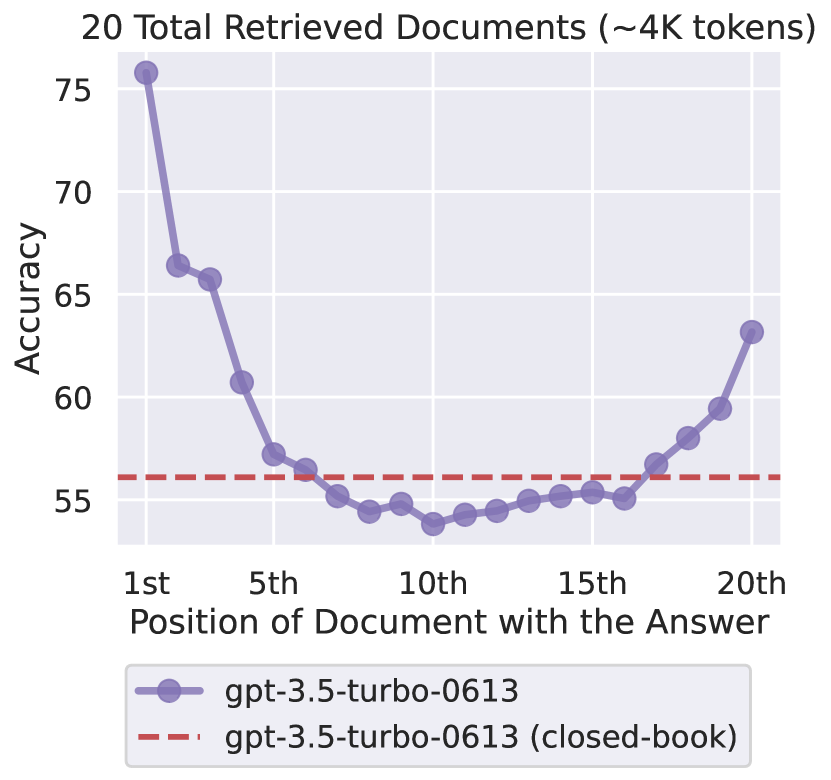

Have you ever been deep into a conversation with an LLM when suddenly it starts forgetting things you said earlier? Maybe it ignores your instructions, repeats itself, or focuses too heavily on the most recent parts of the conversation. Or perhaps when you ask it to complete a longer, multi-part task, the quality starts strong but steadily declines.

It's not just you, and it's known as the *“lost in the middle”* effect.

In this post, I’ll explore what this problem is, why it happens, what current research and benchmarks reveal, and how engineers and researchers are working to fix it. As LLMs become increasingly integrated into our daily lives it's important that we all, not just AI researchers, understand how these models work and where their limitations lie.

# The Problem: When Prompts Get Too Long (Lost-in-the-Middle Effect)

Imagine giving an AI a very long document or chat history and asking a question about something from the middle of it, often the model's answer is wrong or ignores the middle details. This is known as the *"lost in the middle"* effect, and refers to how models tend to recall information at the beginning or end of a long prompt but struggle with the middle.



A good example of this came from the paper *"Lost in the Middle: How Language Models Use Long Contexts" (2023)*. The researchers gave SOTA models a task:

`Retrieve a specific key–value pair hidden in a long list of other distractor pairs.`

Each prompt was structured like:
```
Document:
A: apple  
B: banana  
...  
M: mystery  
...  
Z: zebra

Q: What is the value for M?
```
*Varying the position of the correct key-value pair throughout the prompt.*

Despite being well within the model's context window, performance dropped drastically when the correct answer appeared in the **middle** of the list. This shows that even if the model can technically read the full input, its attention and memory are recency biased. 

# Why LLMs Degrade with Long Context


**1. Attention Spread Thin:**

LLMs use the Transformer architecture, which means every token can attend to every other token. This self-attention mechanism has **O(n^2)** complexity, so if you double the prompt length, the work (and memory) required quadruples. In very long inputs, the model’s “attention” is spread across so many tokens that it has trouble focusing on the right parts. **Essentially, the signal-to-noise ratio worsens *n* grows.** Additionally, because of computation limits, models are typically trained on somewhat short sequences (~2k or 4k tokens). They aren’t well practiced at truly handling, say, 100K tokens of text in one go. The Transformer’s quadratic scaling makes long sequences hard to train on, even at inference time  running 100k+ token prompt is slow and costly.

**2. Positional Encoding Quirks (Bias to Recent Tokens):**

Transformers don't read text in order like humans, they look at all words at once but use **positional encodings** to keep track of order. **RoPE** and **ALiBi** are popular positional encoding methods used in long-context models, but they come with trade-offs. **RoPE** can cause strange behaviors or fail to generalize when pushed beyond its training range, while **ALiBi** favors recent tokens by penalizing distant ones. As a result, even long context models often show a recency bias, focusing more on the end of the input than the beginning or middle contributing to the "lost in the middle" effect.

**3. Training Data Length Mismatch:**

Just because a model supports 100K tokens doesn’t mean it was trained on sequences that long. Most training data consists of short chunks, so models rarely learn to handle very long inputs effectively. In practice, models often use only about half their advertised context length before performance drops due to a left skewed training distribution where short sequences dominate. As a result, even with a 16K window, useful comprehension may taper off after 8K tokens.

**4. Inference Compute Limits and Heuristics:**

Handling long contexts is challenging not just during training, but also at inference time. APIs may impose limits or charge more, and models often use fallback heuristics when faced with very long inputs like ignoring or summarizing parts of the text. Some models even refuse or misinterpret long prompts. These behaviors suggest models aren't truly reading full long contexts and may rely on learned shortcuts or internal constraints. In real world systems, inputs may be chunked behind the scenes, further limiting what the model can actually process.

Essentially, transformer LLMs weren’t inherently designed to handle extremely long sequences or indefinite dialogues, at least not with the same fidelity as short prompts. The combination of quadratic attention scaling, position encoding limitations, lack of long-range training data, and error accumulation leads to the quality degradations.

# Research & Recent Findings

**Lost in the Middle (2023):**

This Stanford study is the one that coined the *lost in the middle* effect. The authors tested LLMs on tasks like question answering across multiple documents and key-value retrieval where the relevant info could appear at different positions in a long input. They found that if the answer was in the middle of the context, performance plummeted compared to when the answer was at the start or end. Even models explicitly built for long inputs struggled with middle content. This paper essentially proved that having a large context window doesn’t guarantee the model uses it effectively, and it provided new evaluation protocols to measure this phenomenon.

**Databricks Long-Context Benchmark Analysis (2024):**

Databricks ran extensive benchmarks to test how well LLMs handle long contexts, especially in RAG settings. They found two major issues: (1) the “lost in the middle” effect, and (2) the effective context length often falling well short of the model’s maximum. For example, a 405B-parameter LLaMA model saw QA accuracy drop past ~32K tokens, and GPT-4’s performance declined beyond ~64K despite supporting longer windows. They also observed various failure modes: some models truncated or rejected long inputs, while others responded with irrelevant answers or gibberish (like Mixtral outputting repeated characters).

**LLMs Get Lost in Multi-Turn Conversation (2025):**

*Definition: Multi-turn refers to conversations involving back and forth exchanges between the user and the model, where the model must remember and build on previous turns rather than treating each prompt as independent.*

A recent Microsoft study analyzed over 200,000 simulated conversations and found that all tested models including GPT-4, Claude, and leading open-source LLMs suffer significant performance drops in multi-turn chats. On average, there was a **39% decline** in task success from single-turn prompts to multi-turn dialogues. Interestingly, the drop wasn’t due to a loss in core ability, but rather a spike in unreliability, models would forget instructions, contradict themselves, or go off-topic. Once an error crept in, models often doubled down instead of correcting course. This study confirms a common observation: longer conversations can confuse LLMs and cause them to get “stuck” in flawed reasoning.

# Measuring Long Context Performance: Benchmarks and Metrics

There are a few methods we use to quantify a model's ability to handle long inputs. The simplest form of evaluation are known as **Neede in a Haystack Tests**. This is the process of planting a *"needle" (piece of information)* in a very long irrelevant text (haystack) and asking the model to find or use it. 

For instance, give a model 10 pages of random text wih one sentence in the middle stating a fact, and then ask a question whose answer is in the fact. If the model truly uses its full context, it should find the fact and answer correctly. Researchers use accuracy on such tasks (did the model correctly identify the needle?) as a basic metric. 

Many LLMs can pass trivial needle tests at short lengths, but as the context grows, they often fail to retrieve the needle. One evaluation showed GPT-3.5-turbo (with a 16K window) dropped nearly 20 percentage points in accuracy when the number of distracting documents increased from 5 to 30.


Furthermore datasets like **LongBench** and **InfiniteBench** compile multiple question-answering tasks that require reading long texts. For example, LongBench includes multi-document QA, where a question might require pulling info from several documents, or dialogue understanding with a long chat history, or code repository Q&A with thousands of lines of code as context. Models are evaluated on metrics like exact match or F1 score (for finding the correct answer span) or multiple-choice accuracy. These benchmarks often categorize results by context length bins (short (e.g. up to 32K), medium (32K–128K), long (128K+), etc.) to see how performance scales (or drops) as input grows.

Reading comprehension over long documents like entire research papers or book chapters is a tough challenge for LLMs. Tasks such as **ArXiv Q&A** or **Book QA** require the model to answer questions based on **10K–20K word** texts. While models can handle simple factual queries, they often struggle with detailed or synthesis based questions. That’s why benchmarks often encourage retrieval and summarization instead of relying on full document prompting. For example, the **QuALITY** dataset showed GPT-4 performed much better when using retrieval to focus on relevant chunks. 

While benchmarks like needle tests, LongBench, and Book QA help quantify long-context performance, they consistently show a key limitation that most models struggle as context length increases, especially when deeper reasoning or synthesis is required. 

# Mitigation via Retrieval Augmented Generation (RAG)

If giving the model more context leads to confusion, one logical solution is not to stuff everything into the prompt. Instead, let the model read in smaller, relevant chunks. This is the philosophy behind Retrieval Augmented Generation (RAG). Rather than feed the entire 100 page document to the LLM, you first use an external retrieval system to fetch the parts that are likely relevant, and only give those to the model (often along with the user’s query or instructions).


In October of 2020 the *"Retrieval-Augmented Generation for Knowledge-Intensive NLP Tasks"* paper was released. Although it wasn't appreciated until years later, it was key in highlighting that models could retain knowledge and handle prompts across large datasets far better than static models. 

RAG uses various like techniques to accomplish this, one of which being **chunking documents**. Long documents or histories are split into chunks and are then indexed by a **vector database** or **search system**. Chunking ensures that each piece is of a manageable size for the model to handle, and it allows the retrieval system to pinpoint relevant sections.

Each chunk is converted to an **embedding** (a numeric representation) using a text **embedding model**. When a user query comes in, it too is embedded, and the system finds which chunks are most semantically similar or relevant to the query. This gives a shortlist of candidate context pieces that likely contain the information needed.

Sometimes the initial similarity search isn’t perfect. A second stage can involve **re-ranking**, where a more precise model evaluates the top N chunks to pick the best few. For instance, you might retrieve 10 chunks, then use a smaller model or a heuristic to rank which 3 are most on point for the question, and only pass those 3 to the final prompt. This helps ensure the model isn’t given noisy context.

*Essentially, it narrows the scope for the LLM.*

# Modern Techniques and Outlook

In the coming months and years one thing is certain and that is larger context windows. We are already seeing various 1M+ context window models from leading labs like Meta, DeepMind, and OpenAI. But as we now know, increased context windows is only the first step. 

Researchers and developers are actively closing the gap between supported context length and effective context use. In the 2024 paper *"Why Effective Context Length Falls Short"* the team at Google Deepmind dramatically improved retrieval from the middle of long contexts in various models. It does this by utilizing a technique known as **StRING (Shifted RoPE)**, this the process of shifting rotary positional embeddings during inference so the model operates within a more familiar range it's seen during training.

An obvious approach to improving effective context is training models on longer sequences of data. As opposed to the old standard of **4k to 8k tokens** it's not rare to see sequences of **64k tokens** or longer during fine-tuning or pretraining.

Various frontier labs are now explicitly training models on synthetic *needle in a haystack* tasks to improve retrieval from long contexts. Alongside this, other techniques like Retrieval-Augmented Generation (RAG), FlashAttention-2, Reinforcement Learning from Human Feedback (RLHF), and Sparse or Hierarchical Attention mechanisms are helping to close the gap between a model’s context window and its effective context usage.

# Strategies and Reflection

In taking on this question I assumed this phenomenon was just user error or a one off here and there, but that was far from the case. The "lost in the middle" effect is a direct result of how today's LLMs distribute attention, encode position, and learn from mostly short sequences. Even as context windows grow into the millions, models still tend to overweight the start and end of their inputs, and can lose focus in the middle. With the multitude of techniques discussed and the variety of smart people working on this issue, there is no doubt in my mind that we will continue to make consistent progress on it.

While these improvements roll out, there are strategies you can implement to improve your experience and model quality.
- State Key Facts Early & Often: If you introduce an important detail repeat or summarize it every so many turns to keep it “fresh” in the model’s effective memory.
- Chunk Your Requests: Break long tasks into smaller sub-prompts. Ask the model to handle one section at a time.
- Use Summaries: If a conversation grows unwieldy, ask the model to summarize the key points so far, then proceed using that summary as context.

With these strategies, we can push current models to their limits and with the coming improvements, those limits will expand even further. The dream of an AI that truly reads and remembers like a human (and better) across vast texts is getting closer by the day.