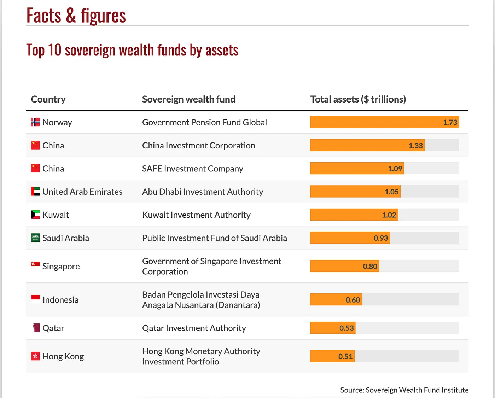

With the U.S. government now taking a 10% stake of Intel, talk of a sovereign wealth fund (SWF) in Washington, and myself currently living here in Singapore where Temasek and state linked companies are part of everyday life. I figured there’s no better time to explore what state capitalism and sovereign wealth fund's are.

State capitalism is an economic system where the government plays a strong role in directing or owning parts of the economy but the underlying market incentives stay the same. Instead of being purely socialist (where the state controls everything for redistribution) or purely capitalist (where private actors dominate), the state acts like a corporate owner/investor. Furthermore, the idea of a Sovereign Wealth Fund (SWF) is to act as a state owned investment fund to manage national savings and invest in global assets with the goal to preserve and grow national wealth.

State capitalism looks different around the world and it's not always implemented through an SWF, the Intel stake in the U.S. for example is a direct equity position (for now at least). In Singapore, Temasek and GIC manage hundreds of billions across airlines, telecoms, and banks. In China, state owned enterprises (SOE) are common in industries from energy to finance while still competing globally (to a certain extent). Norway’s oil backed sovereign wealth fund, channels natural resource revenues into investments that benefit future generations. Meanwhile, countries like Saudi Arabia (via PIF) and the UAE (via Mubadala, ADIA) use SWFs to diversify away from oil and build global economic influence.

# Past and Present of State Capitalism & SWFs

## History in the USA

In the U.S. state capitalism and SWFs are either non-existent or used only other specific circumstances. For example, in the U.S. there has really only been three other times where the U.S government took control of or took a stake in the private sector. You can really categorize it into two main categories: War and Recession's.

First in the 1930s-1940s during the Great Depression the government created government owned corporations like Tennessee Valley Authority (TVA) to build dams, electricity, and stimulate economic development. At the time Private Markets weren't willing to finance massive rural electrification projects leading to the state stepping in. Today, the TVA still exists as one of the largest publicly owned utilities in the U.S. 

The next time we saw something like this in the states was in the 1940s-1960s. During WW2 and the Cold War, the government took direct control over steel, railroads, and shipping, Agencies like DARPA functioned as state funders of private innovation in semi's, computing, and the internet. You could argue that today's biggest tech sectors owe their roots to state directed funding in things like DARPA.

Finally before the new Intel deal the last example of state capitalism in the U.S. was during the 2008 Financial Crisis (TARP Bailouts). Through the Troubled Asset Relief Program (TARP), Washington injected capital into banks and automakers, in some cases taking direct equity stakes. The U.S. became a temporary shareholder in GM, Chrysler, AIG, and major banks. When it was all said and done most shares were later sold back. Taxpayers ultimately lost about $11B on GM but made profits on banks. 

As for SWFs the U.S. has never had one, at most we have seen proposals and partial attempts. The closest thing the U.S. has to a SWF currently is the Alaska Permanant Fund which started in 1976. The state of Alaska started the fund to save and invest oil wealth for future generations and distribute a yearly dividend to residents. The fund has grown to ~$80B+ AUM. It’s the closest thing the U.S. has to an SWF, but at a state level rather than national. 

## Experience Globally

Globally it's another story, SWFs and state capitalism can be seen around the world. In the Gulf, countries like Kuwait, UAE, Saudi Arabia, and Qatar each have their own SWFs with ~$500B-1T+ AUM with stakes in global brands and hopes of diversifying out of oil. In China it is common for SOEs to dominate major industries like energy, space, telecom, finance, and transportation giving the government more control and planning capabilities. China also has their own SWF with ~$1.3T AUM which invests globally but less so than others. Singapore essentially runs two different SWFs, Temasek acts as a holding company managing stakes in domestic companies as well as global investments while GIC is a SWF by brand and manages Singapore's foreign reserves investing globally. In Canada, there is surprisingly multiple "versions" of SWFs branded as pensions. The Canada Pension Plan Investment Board (CPPIB) and most famously the Ontario Teachers Pension Plan (OTPP) have ~$600B+ AUM. Finally, perhaps the most successful SWF of all is Norway's Government Pension Fund Global (GPFG). The GPFG invests exclusively abroad in various assets and excludes domestic firms to avoid overheating the local economy. The GPFG has ~$1.6T AUM, making it the largest SWF in the world while also excluding investments in tobacco, arms, environmental violators.

# What's Happening Today

The U.S. government’s 10% stake in Intel, announced in August 2025, marks a new era of government investment. Unlike past bailouts where Washington acted as a temporary rescuer, this move was structured as a direct equity position putting the U.S. government in the unusual position of being Intel’s single largest shareholder although they have no board seats or voting rights.

The deal is structured to essentially convert existing subsidies (~$9-10B) from the CHIPS and Secure Enclave program act into shares (through Intel issuance of new shares). Intel has been struggling for years, at one point the leader in microprocessors, it has been losing to Taiwan’s TSMC, Nvidia, and even AMD. Billions in losses, layoffs, and missed technology roadmaps have raised questions about its future. The issue is that now more then ever semiconductors are see has an issue of national security that shapes AI, defense, and supply chains. 

# Future Outlook 

Although as of now Intel is a one off position, it seems more likely that this is the beginning of a new economic strategy for America. For decades, the US has been the epicentre of free markets and laissez-faire economics. This leads to a blurry line for what role the U.S. will play in the future of american companies. Will they be a regulator or owner? Will they eventually push for influence and voting rights? It becomes a dangerous game very quickly that could both greatly benefit americans or hurt them. 

Trump seems persistent in pursuing a SWF and seems to be on track to be running in late 2025-2026. If a U.S. SWF is successful in being created there is essentially two possible models. The first would be Norway/Gulf style, investing globally in various assets using profits to strengthen national finances and benefit future generations. Given that this strategy takes means the government would have to consistently run a surplus or have large natrual resource reserves this seems unlikely. The more likely model for the U.S. to follow is that of Temasek in Singapore, running a hedge fund style portfolio of domestic and national investments in various key sectors. 

The next question is in practice how will the U.S. fund a SWF? The U.S. doesn’t have a resource windfall like Norway or Saudi Arabia, and nor does it run a budget surplus (even if it did it has a deficit to pay off), so the options are different. The most likely option would be a reallocation of subsidies, grants, and policy funds (similar to the intel case). Quite frankly this seems like the only realistic option as we have pointed out earlier the other popular options aren't viable here.

The US currently spends very roughly ~$3T on a mix of subsidies, grants, and tax expenditures. But any percentage of this contributed annually to the SWF would instantly make it one of the largest funds in the world. Once the SWF is formed and funds are being allocated a rough idea of what it could look like is the following: 
- Structure: Created as an independent government-owned corporation (like CPPIB in Canada or Temasek in Singapore).
- Governance: Non-political professional managers, reporting to Congress but insulated from daily politics.
- Mandate:
  - Invest in strategic U.S. industries (semiconductors, AI, clean energy).
  - Allocate globally for diversification.
  - Provide returns that either fund the budget or reduce debt.

There is no guarentee this come to fruition, but there is obviously many risks as well as potential benefits to come from a U.S. SWF and shift to a state capitalism style economy. Whether it is a good idea is in the eye of the beholder, perhaps a good exercise is to do a Veil of Ignorance Test:
- Behind veil: you don’t know if you’ll be rich/poor, powerful/powerless.
- Would you prefer an America with or without SWF and State Capitalism?